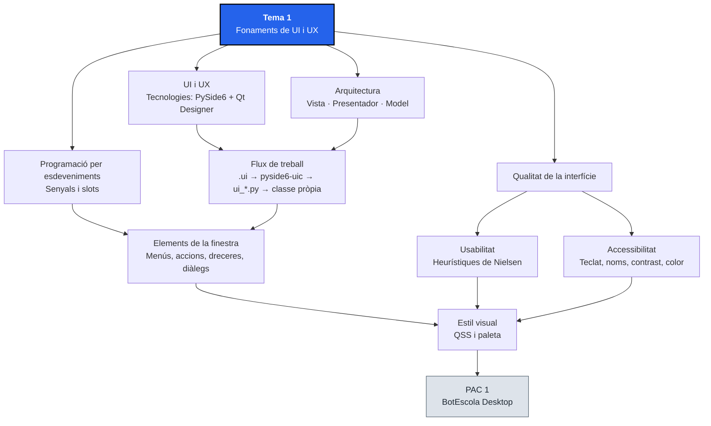
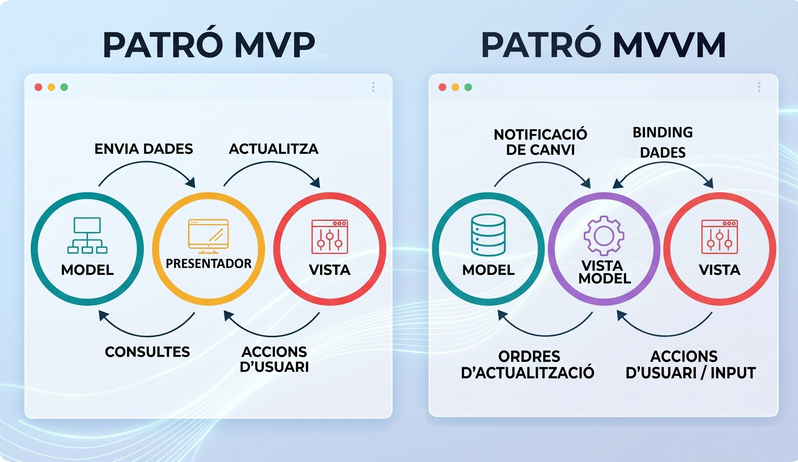
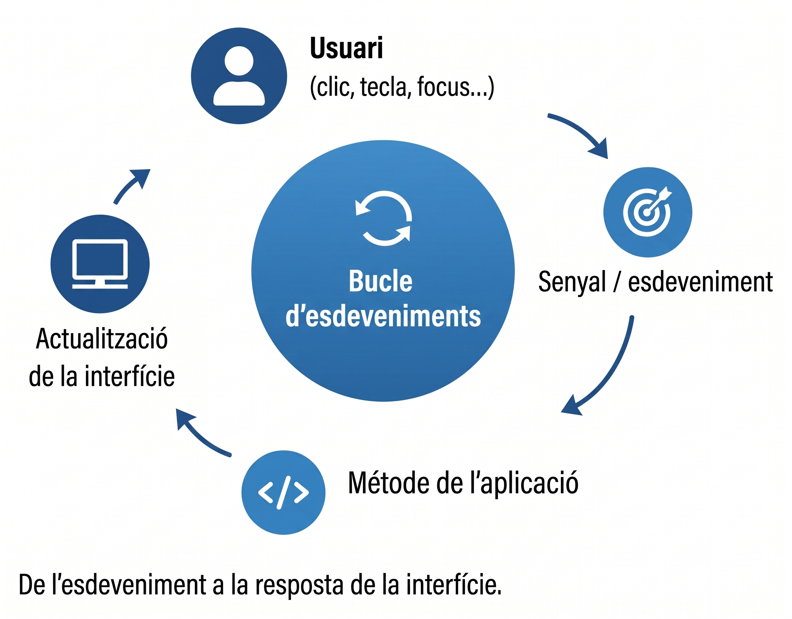
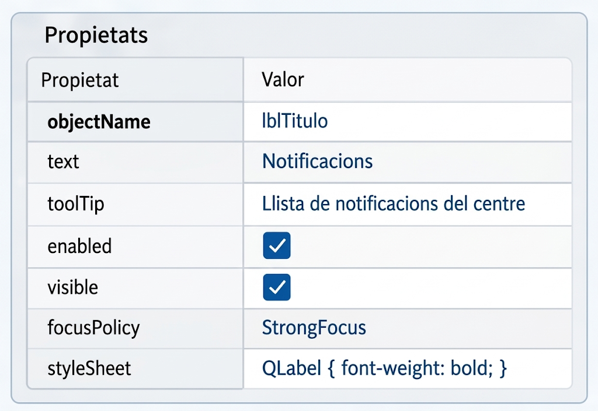
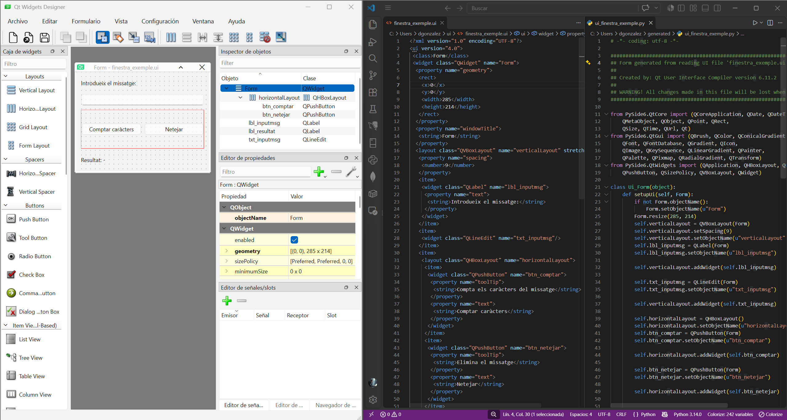
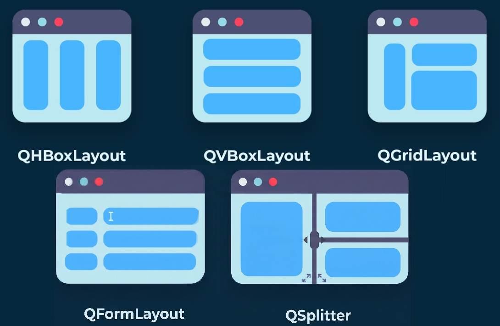
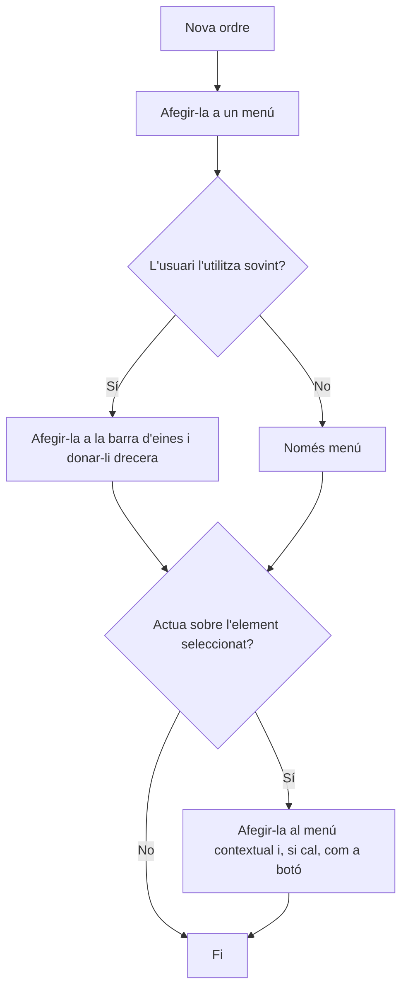

# Tema 1. Fonaments de UI i Experiència d'Usuari

## 1. Identificació

* **Mòdul:** 0488. Desenvolupament d'interfícies
* **Curs:** 1r CFGS de Desenvolupament d'Aplicacions Multiplataforma (DAM)
* **Tema:** 1. Fonaments de UI i Experiència d'Usuari
* **Durada presencial:** 16 hores
* **RA treballats:** RA1 i RA4
* **Prerequisits:** Programació estructurada sobre Python; ús bàsic de la terminal i d'entorns virtuals. No es pressuposa un domini de POO, el Tema 1 introdueix només la terminologia imprescindible i s'acompanya del material de reforç que cobreix els conceptes previs.
* **Projecte transversal:** <mark style="color:violet;">**BotEscola Desktop**</mark>, una aplicació d'escriptori per consultar i gestionar notificacions del centre. S'implementarà el primer entregable funcional, concretament es construirà la finestra principal, separant el disseny de la lògica, s'afegirà una interacció bàsica, una estructura d'ordres (menús, barra d'eines i menú contextual) i un aspecte visual amb contrast verificat (paleta, tipografia i icones), i s'establiran els criteris inicials d'usabilitat i accessibilitat.

### Criteris d'avaluació treballats

#### RA1 Genera interfícies gràfiques d'usuari mitjançant editors visuals utilitzant les funcionalitats de l'editor i adaptant el codi generat.

* CA 1.1: Analitza les eines i llibreries disponibles per a la generació d'interfícies gràfiques.
* CA 1.2: Crea una interfície gràfica utilitzant les eines d'un editor visual.
* CA 1.3: Utilitza les funcions de l'editor per ubicar els components de la interfície.
* CA 1.4: Modifica les propietats dels components per adequar-les a les necessitats de l'aplicació.
* CA 1.5: Analitza el codi generat per l'editor visual.
* CA 1.6: Modifica el codi generat per l'editor visual.
* CA 1.7: Associa als esdeveniments les accions corresponents.
* CA 1.8: Desenvolupa una aplicació que inclou la interfície gràfica obtinguda.

#### Continguts Orientatius

* 1.1 Patrons d'arquitectura de les aplicacions gràfiques.
* 1.2 Llibreries de components natives i multiplataforma. Característiques.
* 1.3 Eines propietàries i lliures d'edició d'interfícies.
* 1.4 Llenguatges descriptius per a la definició d'interfícies.
* 1.5 Components: característiques i camp d'aplicació.
* 1.6 Enllaç de components a orígens de dades.
* 1.7 Associació d'accions a esdeveniments.
* 1.8 Edició del codi generat per l'eina de disseny.
* 1.9 Classes, propietats, mètodes.
* 1.10 Esdeveniments; escoltadors.

#### RA4 Dissenya interfícies gràfiques identificant i aplicant criteris d'usabilitat i accessibilitat.

* CA 4.1: Identifica els principals estàndards d'usabilitat i accessibilitat.
* CA 4.2: Valora la importància de l'ús d'estàndards per crear interfícies.
* CA 4.3: Crea diferents tipus de menús l'estructura i el contingut dels quals segueixen els estàndards establerts.
* CA 4.4: Distribueix les accions en menús, barres d'eines, botons d'ordres, entre d'altres, seguint un criteri coherent.
* CA 4.5: Distribueix adequadament els controls a la interfície d'usuari.
* CA 4.6: Utilitza el tipus de control més apropiat en cada cas.
* CA 4.7: Dissenya l'aspecte de la interfície d'usuari (colors i fonts entre d'altres) tenint en compte la seva llegibilitat.
* CA 4.8: Verifica que els missatges generats per l'aplicació són adequats en extensió i claredat.
* CA 4.9: Realitza proves per avaluar la usabilitat i l'accessibilitat de l'aplicació.

#### Continguts Orientatius

* 4.1 Usabilitat i accessibilitat. Característiques. Pautes. Estàndards.
* 4.2 Mesures d'usabilitat i accessibilitat de les aplicacions; eines.
* 4.3 Esquemes (Wireframes) i Maquetes (Mockups).
* 4.4 Pautes de disseny de l'estructura de la interfície d'usuari: menús, finestres, quadres de diàleg, dreceres de teclat, entre d'altres.
* 4.5 Pautes de disseny de l'aspecte de la interfície d'usuari: colors, fonts, icones, distribució dels elements.
* 4.6 Pautes de disseny dels elements interactius de la interfície d'usuari: botons d'ordre, llistes desplegables, entre d'altres.
* 4.7 Pautes de disseny de la seqüència de control de l'aplicació.

## 2. Presentació

Una aplicació gràfica no executa simplement instruccions de principi a fi. Després d'iniciar-se, crea la interfície principal i es queda a l'espera d'esdeveniments: clics, tecles, canvis de focus o seleccions. La resposta de l'aplicació depèn de la connexió entre aquests esdeveniments i la lògica del programa.

En aquest tema treballarem amb [**PySide6**](https://doc.qt.io/qtforpython-6/gettingstarted.html#getting-started), la llibreria de [**Qt**](https://www.qt.io/) per a Python, i amb [**Qt Widgets Designer**](https://doc.qt.io/qt-6/qtdesigner-manual.html), una eina de disseny visual per a la creació d'interfícies gràfiques. El disseny es desarà en un fitxer `.ui` basat en XML, per posteriorment ser transformat a codi Python mitjançant **`pyside6-uic`**. És important distingir aquesta generació de codi d'una compilació tradicional: en aquest cas, l'eina converteix una descripció declarativa (XML) en codi font Python (PY).

Una aplicació d'escriptori de veritat no és només una finestra amb botons. Organitza les seves ordres en **menús, barres d'eines i menús contextuals** que l'usuari ja coneix d'altres programes, i té un **aspecte visual** pensat perquè la informació es pugui llegir bé: contrast suficient, tipografia clara i estats que no depenen només del color. Per fer-ho, utilitzarem les **accions** de Qt (`QAction`) com a peça central de l'estructura d'ordres i els [**fulls d'estil QSS**](https://doc.qt.io/qt-6/stylesheet.html) (inspirats en CSS) per definir l'aspecte concret en un fitxer separat, tal com el `.ui` separa l'estructura visual i el `.py` la lògica.

Aquest tema es tancarà amb l'inici del projecte transversal <mark style="color:violet;">**BotEscola Desktop**</mark> consistent en aquesta primera fase en una pantalla principal funcional que inclourà: un llistat de notificacions, una secció de detall i un conjunt d'accions per aprovar o descartar les notificacions. Aquestes accions s'organitzaran en menús, barra d'eines i menú contextual, i la pantalla tindrà un aspecte coherent amb contrast verificat. La pantalla haurà de funcionar amb layouts, respondre al teclat i oferir missatges clars d'acord als principis d'usabilitat i accessibilitat treballats.

## 3. Objectius didàctics

En acabar el tema, l'alumne serà capaç de:

1. Comparar llibreries i tecnologies globals de GUI, justificant la seva elecció segons els requeriments tècnics, d'arquitectura i/o de llicència.
2. Elaborar un wireframe que representi la jerarquia de la informació en pantalla i les accions principals.
3. Crear una interfície gràfica amb Qt Widgets Designer i aplicar layouts, sense dependre de les coordenades absolutes de pantalla.
4. Modificar les propietats rellevants dels widgets, incloent-hi `objectName`, text, estat, informació contextual i focus.
5. Interpretar un fitxer `.ui` i generar-ne el mòdul Python corresponent.
6. Integrar el codi generat en una classe pròpia, respectant la separació de responsabilitats, i connectar senyals (events) amb slots (handlers).
7. Seleccionar controls adequats per a llistes, introducció de dades, accions i presentació de missatges.
8. Aplicar les principals heurístiques d'usabilitat de [Nielsen](https://www.nngroup.com/articles/ten-usability-heuristics/) i verificar la navegació amb teclat, l'ordre de tabulació i les dreceres de teclat.
9. Crear una barra de menús, una barra d'eines i un menú contextual a partir d'accions compartides, seguint les convencions dels menús d'escriptori, i distribuir-hi les ordres de l'aplicació amb un criteri coherent.
10. Definir l'aspecte visual d'una interfície (paleta, tipografia i icones) tenint en compte la llegibilitat, verificar-ne el contrast amb la ràtio de [WCAG 2.2](https://www.w3.org/TR/WCAG22/) i aplicar-lo mitjançant un full d'estil QSS centralitzat.

> **Per tot aquell alumnat que tingui nocions de Python però no de POO:** abans del primer laboratori es recomana completar els materials de reforç associats (aprox. 3 h). Per aquest primer tema encara no cal dominar  la POO a Python però necessitem entendre i conèixer els conceptes de **classe, instància, constructor, atribut, mètode, herència, `self`,  `super()` i composició**. Per al Tema 2 s'hi afegeixen **propietats, atributs i mètodes de classe, excepcions i funcions `lambda`**, que el mateix material de reforç ja cobreix.

## 4. Mapa conceptual



## 5. Conceptes fonamentals

### 5.1. L'ecosistema global de les tecnologies GUI

Abans de centrar-nos en Python, és imprescindible conèixer com es desenvolupen les interfícies gràfiques dins la pràctica professional actual. Python és ideal per aprendre i per elaborar eines d'ús intern, però sovint la indústria utilitza altres tecnologies segons quin sigui el producte final desitjat:

| Enfocament                     | Tecnologies destacades                                                                                                                                                                                                                                                                              | Característiques                                                                                                                                                                                                                          | Exemples d'aplicació                                              |
| ------------------------------ | --------------------------------------------------------------------------------------------------------------------------------------------------------------------------------------------------------------------------------------------------------------------------------------------------- | ----------------------------------------------------------------------------------------------------------------------------------------------------------------------------------------------------------------------------------------- | ----------------------------------------------------------------- |
| **Tecnologies Web (Híbrides)** | [Electron](https://www.electronjs.org/), [Tauri](https://tauri.app/), [NW.js](https://nwjs.io/)                                                                                                                                                                                                     | Utilitzen HTML/CSS/JS empaquetat com una aplicació d'escriptori. Electron inclou un navegador complet i consumeix més memòria; Tauri per contra utilitza el motor web del sistema i és més lleuger. Permeten un disseny totalment lliure. | VS Code, Discord, Slack.                                          |
| **Natiu d'escriptori**         | [WPF](https://learn.microsoft.com/en-us/dotnet/desktop/wpf/) / [WinUI](https://learn.microsoft.com/es-es/windows/apps/winui/winui3/) (Windows), [Swift](https://developer.apple.com/swift/)/[AppKit](https://developer.apple.com/documentation/appkit) (macOS), [GTK](https://www.gtk.org/) (Linux) | Alt rendiment i integració perfecta amb el sistema operatiu. Codi lligat (sovint) a una plataforma específica.                                                                                                                            | Aplicacions empresarials, eines específiques de sistema.          |
| **Natiu mòbil**                | [Kotlin](https://kotlinlang.org/)/[Java](https://www.java.com/en/) (Android), [SwiftUI](https://developer.apple.com/swiftui/) (iOS)                                                                                                                                                                 | Específiques per a smartphones i tablets. Aprofiten al màxim el maquinari (càmera, sensors).                                                                                                                                              | Apps comercials i jocs mòbils.                                    |
| **Multiplataforma**            | [Flutter](https://flutter.dev/) (Dart), [React Native](https://reactnative.dev/) (JS), [.NET MAUI](https://dotnet.microsoft.com/es-es/apps/maui) (C#), [JavaFX](https://openjfx.io/) (Java), [Qt](https://www.qt.io/) (C++/Python)                                                                  | Un sol codi base per a diverses plataformes (el suport d'escriptori varia segons la tecnologia). Bon equilibri entre cost de desenvolupament i rendiment.                                                                                 | Eines multiplataforma, aplicacions IoT, indústria automoció (Qt). |

Dins de l'ecosistema **Python**, on desenvoluparem el nostre projecte, les opcions principals disponibles són:

| Llibreria Python                                                                   | Editor visual       | Llicència                               | Punts forts                                | Limitacions                                                                              |
| ---------------------------------------------------------------------------------- | ------------------- | --------------------------------------- | ------------------------------------------ | ---------------------------------------------------------------------------------------- |
| [**Tkinter**](https://docs.python.org/3/library/tkinter.html)                      | No integrat         | Inclosa                                 | Disponible de sèrie.                       | Aparença obsoleta, poc flexible.                                                         |
| [**PyQt6**](https://www.riverbankcomputing.com/software/pyqt/)                     | Qt Widgets Designer | GPLv3 o llicència comercial (Riverbank) | Ecosistema Qt madur, aparença nativa.      | Corba d'aprenentatge moderada; distribuir programari tancat exigeix llicència comercial. |
| [**PySide6**](https://doc.qt.io/qtforpython-6/gettingstarted.html#getting-started) | Qt Widgets Designer | LGPLv3 / GPL / comercial (Qt Company)   | Mateixa base Qt; projecte oficial de Qt.   | Corba d'aprenentatge moderada.                                                           |
| [**Kivy**](https://kivy.org/)                                                      | Parcial             | MIT                                     | Orientació a dispositius tàctils i mòbils. | Controls amb aparença no nativa d'escriptori.                                            |

La **llicència** és un criteri de decisió tècnic i legal: amb PySide6 (LGPL) es pot distribuir una aplicació sense publicar-ne el codi fent un ús conforme a la LGPL, mentre que amb PyQt6 (GPL) cal publicar-lo o comprar una llicència d'ús comercial.

> **Projecte Transversal:** Utilitzarem **PySide6** perquè ens permet treballar amb Qt Widgets Designer, emprar layouts, senyals i slots, widgets accessibles del sistema i una API multiplataforma, amb una llicència (LGPL) que no obliga a publicar el codi de l'aplicació. També ens permetrà oferir una continuïtat coherent amb els temes posteriors sobre components, informes i distribució d'aplicacions.

### 5.2. Separació de responsabilitats i arquitectura d'aplicacions

Un editor visual no imposa, per si sol, un patró d'arquitectura. El que sí facilita és **separar la descripció de la interfície** (`.ui`) del codi que controla el seu comportament.

En aquest curs adoptarem una arquitectura basada en 3 capes:

* **Dades:** informació de l'aplicació, inicialment en estructures Python senzilles.
* **Vista:** widgets, layouts, textos, propietats visuals i estructura definida amb Qt Widgets Designer.
* **Lògica:** codi de resposta a esdeveniments, validacions de l'entrada i actualització de la vista.

Aquesta separació ens permet entendre patrons de disseny com **MVC, MVP i MVVM**, però **sense requerir implementar-los formalment en aquest tema**.&#x20;

<figure><figcaption></figcaption></figure>

Durant el projecte <mark style="color:violet;">**BotEscola Desktop**</mark> adoptarem una organització basada en el principis del [**MVP (Model-Vista-Presentador)**](https://es.wikipedia.org/wiki/Modelo%E2%80%93vista%E2%80%93presentador)**.**

> **Idea clau:** `.ui` descriu _com és_ la interfície; el codi de l'aplicació decideix _què passa_ quan l'usuari interactua amb ella.

### 5.3. De l'execució senqüencial al bucle d'esdeveniments

En un programa clàssic sense interfície gràfica, el flux principal determina l'ordre de les operacions. En una aplicació amb GUI, el programa inicialitza l'aplicació, crea les finestres i entra en un bucle d'esdeveniments. Aquest bucle rep esdeveniments capturats pel sistema i els lliura als objectes corresponents.

<figure><figcaption></figcaption></figure>

En el nostre cas en particular, el bucle no serà un procés que s'estigui consultant contínuament amb un `while` escrit per nosaltres. Serà una funcionalitat proporcionada per Qt i iniciada amb <mark style="color:blue;">**`app.exec()`**</mark>. Això implica que les operacions llargues executades en el fil principal poden arribar a bloquejar la interfície; aquest problema es treballarà més endavant.

### 5.4. Senyals, slots i handlers

En Qt, un **senyal** és una notificació emesa per un objecte quan passa alguna cosa rellevant (per exemple, que s'ha fet clic en un botó). No s'ha de confondre amb l'**esdeveniment** de baix nivell (<mark style="color:red;">**`QEvent`**</mark>: un clic de ratolí, una tecla, un canvi de mida) que el bucle d'esdeveniments lliura al widget: és el widget qui, a partir d'esdeveniments, emet senyals com <mark style="color:blue;">**`clicked`**</mark>. El mecanisme equivalent en altres llenguatges s'anomena _event._ Un **slot** és una funció o mètode que pot rebre aquesta notificació. En Python també és habitual parlar de **handler** o de **funció de callback**.

```python
self.ui.btn_comptar.clicked.connect(self.comptar_caracters)
```

Aquí <mark style="color:blue;">**`clicked`**</mark> és el senyal i <mark style="color:orange;">**`comptar_caracters`**</mark> és el mètode que s'executarà quan el senyal es produeixi. No hi ha parèntesis perquè cal passar una referència al mètode i no pas executar-lo durant la inicialització.

Alguns senyals poden transportar dades. Per exemple, <mark style="color:red;">**`QCheckBox`**</mark><mark style="color:blue;">**`.toggled`**</mark> pot transmetre un booleà que indica si la casella està marcada:

```python
self.ui.chk_activar.toggled.connect(self.ui.btn_comptar.setEnabled)
```

### 5.5. Widgets, propietats i mètodes

* Un **widget** és un objecte visual, com ara <mark style="color:red;">**`QPushButton`**</mark>, <mark style="color:red;">**`QLineEdit`**</mark> o <mark style="color:red;">**`QListWidget`**</mark>.
* Una **propietat** descriu o configura l'estat d'un objecte, com <mark style="color:blue;">**`enabled`**</mark>, <mark style="color:blue;">**`toolTip`**</mark> o <mark style="color:blue;">**`windowTitle`**</mark>.
* Un **mètode** és una operació que l'objecte pot executar, com <mark style="color:orange;">**`clear()`**</mark>, <mark style="color:orange;">**`show()`**</mark> o <mark style="color:orange;">**`setText()`**</mark>.

Per exemple, la propietat <mark style="color:blue;">**`objectName`**</mark> és un identificador intern útil per localitzar el widget des del codi generat; no és un text que vegi l'usuari.

El text visible i el nom intern compleixen funcions diferents. Un botó pot tenir el text `Aprovar notificació` i l'`objectName` `btn_aprovar`.

<figure><figcaption></figcaption></figure>

### 5.6. Fitxer `.ui` i codi generat

El fitxer `.ui` és una descripció XML de la interfície: jerarquia d'objectes, propietats, layouts i connexions que Qt Designer pot desar. A partir d'aquest fitxer es pot generar codi Python amb <mark style="color:violet;">**`pyside6-uic`**</mark>, creant una classe que representa la interfície i que pot ser utilitzada a l'aplicació.

Per això:

* es conserva el `.ui` com a font del disseny;
* es pot regenerar el fitxer `ui_*.py` quan canvia el disseny;
* no s'ha de modificar mai manualment el fitxer generat;
* la lògica pròpia de l'aplicació s'escriu en mòduls independents.

Tot i que Qt també permet carregar el `.ui` en temps d'execució amb <mark style="color:red;">**`QUiLoader`**</mark>, en aquest tema utilitzarem la generació de codi perquè permet veure clarament la separació entre descripció (el fitxer `.ui`), codi generat (el fitxer `ui_*.py`) i codi d'aplicació (el fitxer `main.py` o el fitxer de la classe principal).

<figure><figcaption></figcaption></figure>

### 5.7. Layouts i adaptació a la finestra

Els layouts gestionen la geometria dels widgets i permeten que la interfície s'adapti a diferents mides (sigui responsive). Els més habituals són:

* **`QVBoxLayout`**: distribució vertical.
* **`QHBoxLayout`**: distribució horitzontal.
* **`QGridLayout`**: files i columnes regulars.
* **`QFormLayout`**: parelles etiqueta-camp.
* **`QSplitter`**: permet que l'usuari redimensioni visualment dos panells.

Els layouts no eliminen la necessitat de definir mides mínimes raonables, polítiques d'expansió o proporcions. Però eviten haver de recalcular coordenades i redueixen el risc de solapaments.

<figure><figcaption></figcaption></figure>

### 5.8. Usabilitat i Accessibilitat

La **usabilitat** descriu fins a quin punt una interfície permet que les persones assoleixin els seus objectius amb eficàcia, eficiència i satisfacció en un context d'ús determinat. En aquest tema utilitzarem essencialment les [**10 heurístiques de Nielsen**](https://www.nngroup.com/articles/ten-usability-heuristics/) com a eina de validació. No cal memoritzar-les: cal saber detectar els problemes i justificar les possibles millores.

Treballarem especialment les 7 primeres:

1. **Visibilitat de l'estat del sistema:** després d'una acció, l'aplicació informa del resultat.
2. **Correspondència amb el món real:** els termes i ordres són comprensibles per a l'usuari.
3. **Control i llibertat de l'usuari:** es pot cancel·lar o desfer quan sigui necessari.
4. **Consistència i estàndards:** ordres, controls i comportaments semblants funcionen de manera semblant.
5. **Prevenció d'errors:** es redueixen les situacions d'error abans que es produeixin.
6. **Reconeixement enlloc de record:** les opcions rellevants són visibles o fàcils de descobrir.
7. **Identificació d'errors:** els missatges d'error estan en llenguatge clar, indiquen quin és el problema i en proposen una solució.
8. **Disseny estètic i minimalista:** Interfícies netes i simples.
9. **Flexibilitat i Eficiència d'ús:** Interfície adaptada a usuaris bàsics i a avançats.
10. **Ajuda i Documentació**: la interfície cal que proporcioni ajuda i suport pels diferents tipus d'usuaris.

<div><figure><figcaption><p><strong>1.Visibilitat de l'estat del sistema</strong></p></figcaption></figure> <figure><figcaption><p><strong>2.Correspondència amb el món real</strong></p></figcaption></figure></div>

<div><figure><figcaption><p><strong>3.Control i llibertat de l'usuari</strong></p></figcaption></figure> <figure><figcaption><p><strong>4</strong>.<strong>Consistència i estàndards</strong></p></figcaption></figure></div>

<div><figure><figcaption><p><strong>5.Prevenció d'errors</strong></p></figcaption></figure> <figure><figcaption><p><strong>6.Reconeixement enlloc de record</strong></p></figcaption></figure></div>

<div><figure><figcaption><p><strong>7.Identificació d'errors</strong></p></figcaption></figure> <figure><figcaption><p><strong>8.Disseny estètic i minimalista</strong></p></figcaption></figure></div>

<div><figure><figcaption><p><strong>9.Flexibilitat i Eficiència d'ús</strong></p></figcaption></figure> <figure><figcaption><p><strong>10.Ajuda i Documentació</strong></p></figcaption></figure></div>

L'**accessibilitat** per altra banda, garanteix que persones amb diferents capacitats (visuals, auditives, motrius o cognitives) puguin emprar l'eina.&#x20;

[**WCAG 2.2**](https://www.w3.org/TR/WCAG22/) **és un estàndard sobre accessibilitat desenvolupat principalment per al contingut web**; W3C disposa del [**WCAG2ICT**](https://www.w3.org/WAI/standards-guidelines/wcag/non-web-ict/) (Nota de grup de treball, actualitzada el 2024 i el 2025 en coordinació amb l'EN 301 549) per orientar l'aplicació dels criteris WCAG 2.0, 2.1 i 2.2 a programari i altres solucions no web. Aquesta guia és informativa, no normativa, i no és una especificació pròpia de Qt.

Per tant, en una aplicació Qt d'escriptori combinarem:

* Convencions i capacitats d'accessibilitat de la plataforma;
* Mecanismes d'accessibilitat que ofereix Qt;
* Criteris de WCAG/WCAG2ICT quan siguin aplicables.

En aquest tema verificarem, com a mínim:

* **Teclat:** les funcions principals es poden executar sense dependre exclusivament del ratolí.
* **Focus:** l'ordre de tabulació és lògic i el focus és perceptible.
* **Text i semàntica:** els controls tenen noms i etiquetes comprensibles; quan calgui, configurarem <mark style="color:blue;">**`accessibleName`**</mark> i <mark style="color:blue;">**`accessibleDescription`**</mark> per tal de poder alimentar les eines de lectura de pantalla (_**Screen Readers**_)
* **Color:** el color no serà l'únic mitjà per comunicar un estat o un error.
* **Contrast:** mesurarem el contrast del text i d'indicadors visuals. Com a referència, WCAG 2.2 estableix 4,5:1 per al text normal i 3:1 per a determinats components i indicadors no textuals; per a una aplicació d'escriptori ho tractarem com a **criteri de verificació orientatiu**, aplicant WCAG2ICT i les particularitats de la plataforma.
* **Missatges:** han de ser breus, específics i orientats a l'acció.
* **Redimensionament:** la informació continua sent útil i visible quan es modifica la mida de la finestra.

> **Important:** no afirmarem que una aplicació Qt «compleix WCAG 2.2» només perquè passi una prova de contrast. L'accessibilitat és un conjunt de requisits i proves, i la interoperabilitat amb tecnologies d'assistència també depèn de la plataforma i del suport disponible.

### 5.9. Estructura de l'aplicació: accions, menús i barres d'eines

Una aplicació d'escriptori no ofereix les ordres només amb botons dins de la finestra. Les organitza en una **estructura d'ordres** que l'usuari ja coneix d'altres programes: una barra de menús, una barra d'eines amb les ordres més freqüents, menús contextuals i dreceres de teclat.&#x20;

#### 5.9.1. Anatomia de la Finestra Principal

<mark style="color:red;">**`QMainWindow`**</mark> no és un simple contenidor: reserva un lloc per a cada part d'una aplicació d'escriptori.

```
┌───────────────────────────────────────────────────┐
│ Fitxer  Notificacions  Visualitza  Ajuda          │  <- QMenuBar
├───────────────────────────────────────────────────┤
│ [ Aprovar ]  [ Descartar ]                        │  <- QToolBar
├───────────────────────────────────────────────────┤
│                                                   │
│                 widget central                    │  <- els nostres layouts
│                                                   │
├───────────────────────────────────────────────────┤
│ Missatge d'estat                                  │  <- QStatusBar
└───────────────────────────────────────────────────┘
```

A Qt Widgets Designer, la plantilla _Main Window_ ja inclou la barra de menús i la barra d'estat; la barra d'eines s'hi afegeix amb el botó dret sobre el formulari (_Añadir Barra de Herramientas_).

#### 5.9.2. Un ordre, una acció: `QAction`

Una **acció** (<mark style="color:red;">**`QAction`**</mark>) representa una ordre de l'aplicació **independentment del lloc on apareix**. La mateixa acció es pot afegir a un menú, a una barra d'eines i a un menú contextual, i es pot activar amb una drecera. Quan es fa així:

* El text, la icona i la drecera es defineixen **una sola vegada**;
* <mark style="color:orange;">**`setEnabled(False)`**</mark> inhabilita l'ordre a **tots** els llocs alhora, drecera inclosa;
* L'acció emet un únic senyal (<mark style="color:blue;">**`triggered`**</mark>) i, per tant, hi ha un únic _<mark style="color:violet;">**handler**</mark>_.

| Propietat               | Funció                                                   | Exemple                               |
| ----------------------- | -------------------------------------------------------- | ------------------------------------- |
| `text`                  | Text visible; el caràcter precedit de `&` és el mnemònic | `&Aprovar notificació`                |
| `shortcut`              | Drecera de teclat                                        | `Ctrl+Return`                         |
| `toolTip`               | Ajuda breu en aturar el ratolí                           | `Aprova la notificació seleccionada`  |
| `statusTip`             | Text que apareix a la barra d'estat en explorar el menú  | `Marca la notificació com a aprovada` |
| `icon`                  | Icona (a la barra d'eines i, opcionalment, al menú)      | icona estàndard d'aplicar             |
| `enabled`               | Disponibilitat de l'ordre                                | `False` si no hi ha selecció          |
| `checkable` / `checked` | Ordre amb estat activat o desactivat                     | `Alt contrast`                        |

```python
from PySide6.QtGui import QAction, QKeySequence   # a Qt 6, QAction és a QtGui

act_aprovar = QAction("&Aprovar notificació", self)
act_aprovar.setShortcut(QKeySequence("Ctrl+Return"))
act_aprovar.setStatusTip("Marca la notificació seleccionada com a aprovada")
act_aprovar.triggered.connect(self.aprovar)

menu_notificacions.addAction(act_aprovar)   # al menú
barra_eines.addAction(act_aprovar)          # a la barra d'eines
```

Amb Qt Widgets Designer no cal escriure aquest codi: les accions es creen a l'**Editor de acciones** i s'arrosseguen als menús i a la barra d'eines. Designer les desa al `.ui` i `pyside6-uic` genera els atributs com `self.ui.act_aprovar`. D'aquesta manera només cal connectar el senyal `triggered` per part del nostre controlador/presentador. Per coherència amb la nomenclatura, els noms d'objecte de les accions portaran el prefix `act_`.

> **Atenció:** a Qt6 la classe `QAction` és a `PySide6.QtGui`, no a `QtWidgets` com a Qt 5. Molts tutorials antics fan la importació incorrecta i produeixen un `ImportError`.

#### 5.9.3. Tipus de menús

| Tipus                                          | Com es crea                                                                                                                                                                                                             | Ús a BotEscola Desktop                                                    | Criteri d'ús                                                                                |
| ---------------------------------------------- | ----------------------------------------------------------------------------------------------------------------------------------------------------------------------------------------------------------------------- | ------------------------------------------------------------------------- | ------------------------------------------------------------------------------------------- |
| **Barra de menús**                             | <mark style="color:red;">**`QMenuBar`**</mark> (<mark style="color:orange;">`menuBar()`</mark>)                                                                                                                         | `Fitxer`, `Notificacions`, `Visualitza`, `Ajuda`                          | Conté **totes** les ordres, agrupades per tema                                              |
| **Menú desplegable** amb elements i separadors | <mark style="color:red;">**`QMenu`**</mark> amb <mark style="color:orange;">`addAction()`</mark> i <mark style="color:orange;">`addSeparator()`</mark>                                                                  | Menú `Notificacions`                                                      | Agrupa ordres relacionades.                                                                 |
| **Submenú**                                    | <mark style="color:red;">**`QMenu`**</mark><mark style="color:orange;background-color:orange;">**`.addMenu()`**</mark>                                                                                                  | `Text > Mostrar` (exercici G) i `Visualitza > Text` (ampliació de la PAC) | Com a màxim un nivell de submenú                                                            |
| **Menú contextual**                            | <mark style="color:orange;">**`setContextMenuPolicy`**</mark>`(`<mark style="color:red;">**`Qt.ContextMenuPolicy.ActionsContextMenu`**</mark>`)` i <mark style="color:orange;">**`addAction()`**</mark> sobre el widget | Clic dret sobre la llista                                                 | Només ordres que afecten l'element seleccionat; mai és l'única manera d'arribar a una ordre |
| **Menú amb ordres marcables**                  | `QAction.setCheckable(True)`                                                                                                                                                                                            | `Visualitza > Alt contrast`                                               | L'estat s'ha de veure (marca) i s'ha de poder desfer                                        |

Amb <mark style="color:red;">**`ActionsContextMenu`**</mark>, Qt construeix el menú contextual amb les accions afegides al widget, sense escriure cap _handler_ de clic dret. Si el contingut del menú ha de canviar segons el context, s'utilitza <mark style="color:red;">**`CustomContextMenu`**</mark> i el senyal <mark style="color:blue;">**`customContextMenuRequested`**</mark>; no ho necessitarem en aquest tema.

#### 5.9.4. Estàndards de contingut i estructura dels menús

Les convencions dels menús no provenen de WCAG, sinó de les **guies de disseny de cada plataforma d'escriptori** (Windows, Apple Human Interface Guidelines, GNOME HIG, KDE HIG). Són coincidents en allò fonamental, que és el que apliquem:

| Convenció                                                                                 | Exemple                                                   | Per què                                                       |
| ----------------------------------------------------------------------------------------- | --------------------------------------------------------- | ------------------------------------------------------------- |
| Menús estàndard en l'ordre habitual; `Ajuda` sempre l'últim                               | `Fitxer`, `Notificacions`, `Visualitza`, `Ajuda`          | L'usuari sap on buscar                                        |
| Text breu, sense articles, amb la **mateixa forma verbal** a tota l'aplicació             | `Aprovar notificació`, `Descartar…`, `Sortir` (infinitiu) | Consistència                                                  |
| **Punts suspensius (`…`)** si l'ordre demana informació o confirmació abans d'executar-se | `Descartar…`, `Quant a BotEscola…`                        | Avisa que no s'executa immediatament                          |
| Ordres relacionades agrupades i separades                                                 | `Aprovar` i `Descartar` junts                             | Lectura ràpida                                                |
| Dreceres estàndard per a ordres estàndard                                                 | `Ctrl+Q` (sortir), `F1` (ajuda), `Ctrl++` (ampliar)       | Les coneix l'usuari                                           |
| **Inhabilitar** les ordres no disponibles, no amagar-les                                  | `Aprovar` gris sense selecció                             | L'usuari veu que l'ordre existeix i entén que no és aplicable |
| Com a màxim dos nivells de profunditat                                                    | menú → submenú                                            | Menús navegables                                              |
| Les ordres destructives, separades de les habituals i amb confirmació                     | `Descartar…`                                              | Prevenció d'errors                                            |
| Mnemònics únics dins de cada nivell                                                       | `&Fitxer`, `&Notificacions`, `&Visualitza`, `A&juda`      | Evita conflictes                                              |

Aquestes convencions s'apliquen a aplicacions d'escriptori. En macOS, la barra de menús és a la part superior de la pantalla i Qt mou automàticament algunes ordres (`Quant a`, `Preferències`, `Sortir`) al menú de l'aplicació segons el seu rol (`menuRole`). El menú s'ha de dissenyar pensant en la plataforma on s'utilitzarà.

#### 5.9.5. Distribuir les ordres: menú, barra d'eines, botons, menú contextual i dreceres

Una mateixa ordre pot ser present a diversos llocs. La redundància és intencionada, però cada lloc té un paper:

| Lloc                     | Què hi va                                                    | Criteri                                       | Exemple a BotEscola                   |
| ------------------------ | ------------------------------------------------------------ | --------------------------------------------- | ------------------------------------- |
| **Barra de menús**       | Totes les ordres, agrupades                                  | Descobribilitat: l'usuari pot explorar-ho tot | `Notificacions > Aprovar notificació` |
| **Barra d'eines**        | Les ordres més freqüents (poques, amb icona i text)          | Accés ràpid                                   | `Aprovar`, `Descartar`                |
| **Botons a la finestra** | Ordres lligades al contingut visible (l'element seleccionat) | Proximitat al que es veu                      | Botons sota el detall                 |
| **Menú contextual**      | Ordres sobre l'element seleccionat                           | Rapidesa                                      | Clic dret a la llista                 |
| **Drecera de teclat**    | Les ordres freqüents                                         | Eficiència i accessibilitat                   | `Ctrl+Return`                         |

Regla de decisió: **tota ordre ha de ser accessible des d'un menú**; la barra d'eines, els botons, el menú contextual i les dreceres són accelerants. Si una ordre només existeix com a botó o com a drecera, l'usuari que no la coneix no la trobarà.



Per evitar duplicar codi, **les accions són l'única font de comportament**: el botó `Aprovar notificació` no té un _handler_ propi, sinó que activa l'acció (`btn_aprovar.clicked.connect(act_aprovar.trigger)`). Aquesta connexió la podem fer a través de l'**Editor de señales/slots** de Qt Widgets Designer. Així el menú, la barra d'eines, el menú contextual, la drecera i el botó fan exactament el mateix.&#x20;

#### 5.9.6. Dreceres de teclat i mnemònics

Són dos mecanismes diferents:

|                | **Mnemònic**                              | **Drecera (**_**shortcut**_**)**                 |
| -------------- | ----------------------------------------- | ------------------------------------------------ |
| **Sintaxi**    | `&` davant la lletra del text (`&Fitxer`) | `setShortcut(QKeySequence(...))`                 |
| **Combinació** | `Alt` + lletra                            | Normalment `Ctrl` + tecla                        |
| **Funció**     | Obre un menú o activa un control visible  | Executa l'ordre directament, sense obrir el menú |
| **Es mostra**  | Lletra subratllada                        | Al costat del text del menú                      |

Criteris que cal aplicar:

* **No repeteixis un mnemònic** entre elements del mateix àmbit. Si la barra de menús té `&Ajuda` i un botó de la mateixa finestra té `&Aprovar notificació`, tots dos utilitzen `Alt+A` i la lletra deixa de funcionar de manera fiable (Qt parla de _shortcut ambigu_). La solució és escollir una altra lletra: `A&juda`. Dins d'un menú obert els mnemònics són independents dels d'altres menús.
* Per a les ordres estàndard utilitza `QKeySequence.StandardKey` (`Copy`, `Find`, `HelpContents`, `ZoomIn`, `ZoomOut`…): Qt tria la combinació adequada a cada plataforma.
* A macOS, Qt tradueix `Ctrl` a `Cmd` de manera automàtica; no cal fer-ho a mà.
* `Return` és la tecla principal d'Intro; `Enter` és la del teclat numèric. Qt les tracta com a tecles diferents i, en general, `Ctrl+Return` no respon a la segona; si vols que responguin les dues, assigna les dues combinacions amb `setShortcuts([...])`.
* No reutilitzis una drecera estàndard per a una altra funció (per exemple, `Ctrl+C` per aprovar).
* Els menús s'han de poder recórrer amb el teclat (`Alt`, fletxes, `Intro` i `Esc`) sense configuració addicional. Comprova-ho.

#### 5.9.7. Estat de les ordres i seqüència de control

Una ordre només ha d'estar disponible quan té sentit. `Aprovar` i `Descartar` actuen sobre una notificació seleccionada; sense selecció han d'estar **inhabilitades** a tots els llocs. Com que són una sola acció, n'hi ha prou amb una funció que es crida quan canvia la selecció:

```python
def actualitzar_estat_accions(self):
    hi_ha_seleccio = self.ui.lst_notificacions.currentItem() is not None
    self.ui.act_aprovar.setEnabled(hi_ha_seleccio)
    self.ui.act_descartar.setEnabled(hi_ha_seleccio)
    self.ui.btn_aprovar.setEnabled(hi_ha_seleccio)
    self.ui.btn_descartar.setEnabled(hi_ha_seleccio)
```

Això és part del **disseny de la seqüència de control** de l'aplicació: l'aplicació guia l'usuari indicant què pot fer en cada moment.

Les ordres **destructives o no reversibles** han de demanar confirmació. Un bon diàleg de confirmació:

* Descriu l'objecte i la conseqüència ("Vols descartar la notificació «…»? No es pot desfer");
* Utilitza **botons amb verbs explícits** (`Descartar` i `Cancel·lar`) en lloc de `Sí` i `No`;
* Té com a opció per defecte la **més segura** (`Cancel·lar`);
* Si l'usuari cancel·la, no canvia res i ho comunica.

```python
from PySide6.QtWidgets import QMessageBox

def confirma_descart(self, titol_notificacio):
    caixa = QMessageBox(self)
    caixa.setIcon(QMessageBox.Icon.Warning)
    caixa.setWindowTitle("Descartar notificació")
    caixa.setText(f"Vols descartar la notificació «{titol_notificacio}»?")
    caixa.setInformativeText("Aquesta acció no es pot desfer.")
    boto_descartar = caixa.addButton("Descartar", QMessageBox.ButtonRole.DestructiveRole)
    boto_cancellar = caixa.addButton("Cancel·lar", QMessageBox.ButtonRole.RejectRole)
    caixa.setDefaultButton(boto_cancellar)
    caixa.setEscapeButton(boto_cancellar)
    caixa.exec()
    return caixa.clickedButton() is boto_descartar
```

Aquest exemple aplica dues de les heurístiques de Nielsen de l'apartat 5.8: **control i llibertat de l'usuari** (poder desfer o cancel·lar) i **prevenció d'errors**.

### 5.10. Aspecte visual: color, contrast, tipografia i icones

L'aspecte d'una interfície no és decoració, sinó que determina si l'usuari pot **llegir** la informació, distingir estats i localitzar els controls. Aquest apartat treballa criteris **mesurables**, no gustos ("queda bonic").

#### 5.10.1. Contrast

El **contrast** entre el text i el fons es mesura amb la **ràtio de contrast**, un valor entre `1:1` (mateix color) i `21:1` (negre sobre blanc). Es calcula a partir de la lluminància relativa de cada color:

```python
L = 0,2126·R + 0,7152·G + 0,0722·B      (amb cada canal sRGB linealitzat)
ràtio = (L_clar + 0,05) / (L_fosc + 0,05)
```

No cal fer aquest càlcul a mà: al projecte inclourem el _helper_ `contrast.py` (vegeu l'apartat [6.3](./#id-6.3.-fulls-destil-i-verificador-de-contrast)), que reb dos colors en format `#RRGGBB`.

Els llindars de referència són els de [**WCAG 2.2**](https://www.w3.org/TR/WCAG22/):

| Element                                                                                              |     Mínim | Criteri WCAG 2.2                                                         |
| ---------------------------------------------------------------------------------------------------- | --------: | ------------------------------------------------------------------------ |
| Text normal                                                                                          |     4,5:1 | 1.4.3 Contrast (mínim)                                                   |
| Text gran (≥ 18 pt, o ≥ 14 pt en negreta)                                                            |       3:1 | 1.4.3                                                                    |
| Components de la interfície (vores de camps i botons, indicador de focus) respecte del fons adjacent |       3:1 | 1.4.11 Contrast no textual                                               |
| Text d'un control inhabilitat                                                                        | No exigit | Excepció de 1.4.3; ha de ser igualment distingible del control habilitat |

> **Àmbit d'aplicació:** WCAG és un estàndard **web**. No és automàticament l'estàndard de les aplicacions d'escriptori. L'utilitzem perquè fixa valors numèrics verificables i perquè l'estàndard europeu [**EN 301  549**](https://www.etsi.org/deliver/etsi_en/301500_301599/301549/03.02.01_60/en_301549v030201p.pdf) (accessibilitat de productes i serveis TIC) aplica criteris equivalents també al programari que no és web. Les guies de plataformes d'escriptori (Windows, macOS, GNOME, KDE) recomanen contrast suficient, però no en fixen llindars numèrics.

Exemples calculats amb `contrast.py`:

| Text      | Fons      |   Ràtio | Text normal (4,5:1) |
| --------- | --------- | ------: | ------------------- |
| `#1F2933` | `#FFFFFF` | 14,76:1 | Compleix            |
| `#767676` | `#FFFFFF` |  4,54:1 | Compleix (just)     |
| `#999999` | `#FFFFFF` |  2,85:1 | **No compleix**     |
| `#FFFFFF` | `#2563EB` |  5,17:1 | Compleix            |

#### Contrast de l'indicador de focus

L'indicador de focus ha de contrastar amb **tots** els colors que toca, no només amb el fons de la finestra. Un contorn negre (`#000000`) sobre fons blanc té 21:1, però si el control té un fons de color, el contorn també toca aquest color. Amb l'accent `#2563EB` el contorn negre dona 4,06:1 (compleix); amb un blau més fosc com `#1F4E8C` en donaria només 2,53:1 (no compleix el 3:1). Per això l'accent s'ha escollit dins del marge en què el text blanc sobre l'accent arriba a 4,5:1 **i** el contorn negre sobre l'accent arriba a 3:1. Comprova les dues parelles amb `contrast.py` abans de fixar un color d'accent.

#### 5.10.2. El color com a informació

El color no pot ser l'única manera de transmetre un estat. Una part apreciable de la població té algun tipus de daltonisme (al voltant del 8 % dels homes, segons les estimacions habituals), i el color també falla amb pantalles poc calibrades, il·luminació forta o impressió en blanc i negre.&#x20;

Criteris recomanats:

* Acompanya sempre el color amb **text, imatges o icones**: `Error: el port ha de ser un enter entre 1 i 65535` és millor que un camp de text de fons vermell.
* Defineix una **paleta reduïda** amb un significat per a cada color (text, fons, accent, error, èxit) i reutilitza'l a tota l'aplicació.
* Comprova la interfície **en escala de grisos**: si l'estat continua sent comprensible, no depèn del color.
* Els colors de significat convencional (vermell per a error, verd per a èxit) són una ajuda, no una garantia.

#### 5.10.3. Tipografia

* **Utilitza la font del sistema.** Qt la pren de la plataforma: és llegible, cobreix tots els caràcters de la llengua i respecta la configuració de l'usuari. Fixar una font pròpia només s'ha de fer per una raó de disseny justificada.
* **Limita les famílies i les mides.** Una família de font és suficient. Estableix una jerarquia amb **mida i pes** (negreta per a títols de secció) i no més de tres nivells.
* **Mida mínima.** El text funcional no ha de quedar per sota de la mida per defecte de la plataforma. Com a referència mínima verificable, no utilitzis text per sota de **9 pt**.
* **Amplada de línia.** En texts llargs (com el detall d'una notificació), 50-75 caràcters per línia faciliten la lectura.&#x20;
* **Alineació i estil.** Alinea el text a l'esquerra en textos llargs. Evita el text justificat, els textos llargs en majúscules o en cursiva, i el subratllat de text que no sigui un enllaç.
* **Text redimensionable.** L'usuari pot augmentar l'escala del sistema o la mida de la font. Els layouts han de suportar que el text creixi sense superposar-se ni tallar informació.

#### 5.10.4. Icones

* Han de ser **reconeixibles i coherents** entre elles (mateix estil i mida).
* Les icones **sense text** només són acceptables si el significat és universal (`tancar`, `desar`) i sempre amb `toolTip` i nom accessible. Quan no és així, s'acompanyen de text: a la barra d'eines, `ToolButtonTextBesideIcon`.
* Han de tenir un contrast d'almenys 3:1 amb el fons si transmeten informació.
* Al projecte utilitzarem **icones del propi estil de Qt** amb `QStyle.standardIcon(...)`: no requereixen cap fitxer extern i s'adapten a la plataforma. Les icones pròpies (fitxers `.svg` o `.png` carregats amb un fitxer de recursos `.qrc`) queden fora de l'abast d'aquest tema.

#### 5.10.5. Criteris verificables de llegibilitat

Aquests són els criteris que s'utilitzaran per avaluar l'aspecte d'una interfície gràfica:

* [ ] Cada parella de color de text/fons té una ràtio ≥ 4,5:1 (≥ 3:1 si és text gran) i està documentada.
* [ ] Les vores dels controls i l'indicador de focus tenen una ràtio ≥ 3:1 respecte del fons adjacent.
* [ ] Cap estat ni missatge depèn només del color.
* [ ] La font és la del sistema i no hi ha text per sota de 9 pt.
* [ ] La jerarquia es marca amb no més de tres mides o pesos diferents.
* [ ] Les ordres de la barra d'eines tenen text o `toolTip` i nom accessible.
* [ ] La interfície continua sent llegible amb la finestra redimensionada.

### 5.11. Aplicar l'aspecte a Qt: paleta, fonts i fulls d'estil (QSS)

Qt ofereix diverses maneres de controlar l'aspecte:

| Mecanisme                                    | Què permet                                           | Avantatges                                                      | Limitacions                                                                   |
| -------------------------------------------- | ---------------------------------------------------- | --------------------------------------------------------------- | ----------------------------------------------------------------------------- |
| **Estil i paleta del sistema**               | Utilitzar l'aspecte per defecte de la plataforma     | Respecta el tema clar/fosc i el mode d'alt contrast de l'usuari | Poc control sobre la identitat visual                                         |
| **`QPalette` i `QFont`** (en codi)           | Canviar colors i fonts de manera global o per widget | Mantenen l'estil nadiu                                          | Menys flexible per als estats (`hover`, `focus`…)                             |
| **QSS (fulls d'estil de Qt)**                | Definir l'aspecte amb regles semblants a CSS         | Flexible, centralitzable en un fitxer, distingeix estats        | Substitueix l'estil nadiu dels widgets afectats; no s'adapta sol al tema fosc |
| **`styleSheet` dins de Qt Widgets Designer** | QSS escrit widget per widget                         | Ràpid per provar                                                | Dispers, difícil de mantenir i de revisar                                     |

Durant el projecte <mark style="color:violet;">**BotEscola Desktop**</mark> utilitzarem la tècnica del **QSS en un únic fitxer extern** (`estils/*.qss`) carregat des del codi. Hi ha dues raons: permet definir la paleta i **verificar-ne el contrast**, i separa l'aspecte del disseny estructural (`.ui`) i de la lògica (`.py`). Cal ser conscient del cost: en fixar colors, l'aplicació deixa de seguir el tema clar/fosc del sistema. Per això a l'ampliació del projecte s'ofereix una variant d'alt contrast.

#### Sintaxi bàsica de QSS

```css
selector {
    propietat: valor;
}
```

| Selector               | Significat                            | Exemple                                      |
| ---------------------- | ------------------------------------- | -------------------------------------------- |
| `QPushButton`          | Tots els botons (i subclasses)        | `QPushButton { ... }`                        |
| `QLabel#lbl_resultat`  | El widget amb aquest `objectName`     | `QLabel#lbl_resultat { font-weight: bold; }` |
| `QLineEdit:focus`      | Pseudoestat: el camp té el focus      | `:hover`, `:disabled`, `:checked`, `:focus`  |
| `QMenu::item:selected` | Subcontrol amb pseudoestat            | Element seleccionat d'un menú                |
| `QMenuBar, QToolBar`   | Diversos selectors separats per comes | Mateixa regla per a tots dos                 |

Una regla més específica (per exemple, `QLabel#lbl_resultat`) preval sobre una de general (`QLabel`). Un full d'estil assignat a un widget preval sobre el de l'aplicació. Per aquest motiu, un únic fitxer d'aplicació i cap `styleSheet` dins de Designer és el camí més senzill de mantenir.

#### Regles que eviten errors habituals

1. **Defineix sempre `color` i `background-color` junts** a la mateixa regla. Si només fixes el color del text, el fons continua venint del sistema: amb tema fosc, el text pot quedar il·legible.
2. **No eliminis l'indicador de focus.** Regles com `border: none` o `outline: none` en un control amb `:focus` fan invisible la navegació amb teclat.
3. **No utilitzis `font-size` ni `font-family` al QSS** si vols canviar la mida amb `QFont` des del codi: la regla QSS té prioritat sobre el `QFont`.&#x20;
4. **Els errors de QSS són silenciosos.** Una regla mal escrita simplement no s'aplica. Qt escriu un avís (_Could not parse stylesheet_) a la consola: llegeix-la.
5. **No t'oblidis de mantenir la mida dels controls en canviar d'estat.** Si el focus augmenta el gruix de la vora (`1px` → `3px`), el control canvia de mida. Fixa el gruix i canvia només el color (`border-color`).
6. **Carrega el fitxer amb una ruta relativa al mòdul**, no a la carpeta des d'on s'executa el programa.

```python
from pathlib import Path

RUTA_ESTILS = Path(__file__).parent / "estils"

def carrega_estil(app, fitxer):
    """Carrega un full d'estil QSS de la carpeta estils/."""
    ruta = RUTA_ESTILS / fitxer
    app.setStyleSheet(ruta.read_text(encoding="utf-8"))
```

Per canviar la mida del text de tota l'aplicació es fa servir la font de l'aplicació, sempre que el QSS no en fixi la mida:

```python
def canvia_mida_text(increment):
    app = QApplication.instance()
    font = app.font()
    font.setPointSizeF(max(9.0, min(20.0, font.pointSizeF() + increment)))
    app.setFont(font)
```

Aquest fragment suposa que la font del sistema s'expressa en punts.

## 6. Entorn de treball

### 6.1. Estructura d'un projecte bàsic

```
projecte_exemple/
├── ui/
│   ├── finestra_exemple.ui
│   └── finestra_menus.ui
├── generated/
│   ├── ui_finestra_exemple.py
│   └── ui_finestra_menus.py
├── estils/
│   └── exemple.qss
├── app.py
├── app_menus.py
├── contrast.py
└── README.md
```

La carpeta `generated/` conté fitxers generats. En un projecte real es decidiria, segons l'equip i la configuració de control de versions, si es versionen o si es regeneren en el procés de construcció. En aquest tema es lliuraran per facilitar-ne la correcció.

### 6.2. Entorn virtual i instal·lació

```bash
python -m venv .venv
```

Activació:

* **Windows PowerShell:** `.venv\Scripts\Activate.ps1` (si PowerShell bloqueja l'execució de scripts, executa abans `Set-ExecutionPolicy -Scope Process -ExecutionPolicy RemoteSigned`, que només afecta la sessió actual)
* **Windows CMD**: `.venv\Scripts\activate.bat`
* **Linux/macOS**: `source .venv/bin/activate`

Instal·lació de PySide6:

```bash
python -m pip install --upgrade pip
python -m pip install PySide6
```

Comprovació:

```bash
python -c "import PySide6; print(PySide6.__version__)"
```

Qt Widgets Designer i el generador s'executen amb les eines instal·lades pel paquet:

Dissenyador Visual:

```bash
pyside6-designer
```

Generació de codi Python a partir del fitxer .ui:

```bash
pyside6-uic ui/finestra_exemple.ui -o generated/ui_finestra_exemple.py
```

Si la comanda no es troba, cal verificar que l'entorn virtual està actiu i que els scripts de l'entorn es trobin al `PATH` de sistema. També es pot executar l'eina mitjançant el mòdul o la ruta corresponent a la instal·lació local.

### 6.3. Fulls d'estil i verificador de contrast

La gestió dels estils i la verificació de contrast, requereix dels següents fitxers/carpetes:

* `estils/`: fulls d'estil `.qss` . Són fitxers de text que **sí que s'editen manualment**; no són codi generat.
* `contrast.py`: petit _helper_ que calcula la ràtio de contrast entre dos colors. No depèn de PySide6.

Crea `contrast.py` a l'arrel del projecte:

```python
"""Càlcul de la ràtio de contrast WCAG entre dos colors (#RRGGBB)."""

import sys


def _canal(valor):
    """Converteix un canal sRGB (0-255) a valor lineal."""
    c = valor / 255
    return c / 12.92 if c <= 0.04045 else ((c + 0.055) / 1.055) ** 2.4


def lluminancia(color):
    """Lluminància relativa d'un color en format #RRGGBB."""
    h = color.lstrip("#")
    r, g, b = (int(h[i:i + 2], 16) for i in (0, 2, 4))
    return 0.2126 * _canal(r) + 0.7152 * _canal(g) + 0.0722 * _canal(b)


def ratio(color1, color2):
    """Ràtio de contrast entre dos colors (de 1:1 a 21:1)."""
    l1, l2 = sorted((lluminancia(color1), lluminancia(color2)), reverse=True)
    return (l1 + 0.05) / (l2 + 0.05)


if __name__ == "__main__":
    if len(sys.argv) != 3:
        print('Ús: python contrast.py "#RRGGBB" "#RRGGBB"')
        sys.exit(1)
    r = ratio(sys.argv[1], sys.argv[2])
    print(f"Ràtio de contrast: {r:.2f}:1")
    print("Text normal (mínim 4,5:1):", "compleix" if r >= 4.5 else "NO compleix")
    print("Text gran i components (mínim 3:1):", "compleix" if r >= 3 else "NO compleix")
```

Comprova-ho amb un cas conegut. Escriu els colors **entre cometes**: sense elles, alguns terminals interpreten `#` com l'inici d'un comentari.

```bash
python contrast.py "#FFFFFF" "#000000"
```

Ha de mostrar `Ràtio de contrast: 21.00:1`.

## 7. Exemple guiat: Comptador de caràcters

### Pas 1. Wireframe previ

Abans d'obrir el dissenyador visual, descriu la pantalla:

```
[ Introdueix el missatge:                          ]
[ Camp de text                                     ]

[ Comptar caràcters ]          [      Netejar      ]

Resultat: -
```

El wireframe no defineix colors ni detalls gràfics. Serveix per decidir quina informació és necessària, quina acció és principal i com s'ordenen els elements.

### Pas 2. Disseny a Qt Widgets Designer

1. Executa <mark style="color:violet;">**`pyside6-designer`**</mark>.
2. Crea un formulari de tipus **Widget**.
3. Afegeix un <mark style="color:red;">`QLabel`</mark> amb el text `Introdueix el missatge:`.
4. Afegeix un <mark style="color:red;">`QLineEdit`</mark> amb <mark style="color:blue;">`objectName`</mark> `txt_missatge`.
5. Afegeix un <mark style="color:red;">`QPushButton`</mark> amb <mark style="color:blue;">`objectName`</mark> `btn_comptar` i text `Comptar caràcters`.
6. Afegeix un <mark style="color:red;">`QPushButton`</mark> amb <mark style="color:blue;">`objectName`</mark> `btn_netejar` i text `Netejar`.
7. Afegeix un <mark style="color:red;">`QLabel`</mark> amb <mark style="color:blue;">`objectName`</mark> `lbl_resultat` i text `Resultat: -`.
8. Selecciona el formulari i aplica un <mark style="color:red;">`QVBoxLayout`</mark>.
9. Agrupa els dos botons en un <mark style="color:red;">`QHBoxLayout`</mark>; l'objectiu és que els controls quedin dins d'una jerarquia de layouts.
10. Assigna tooltips als botons i desa el fitxer com `ui/finestra_exemple.ui`.

No cal fixar coordenades. Si Qt Widgets Designer mostra temporalment una disposició lliure, el disseny encara no és correcte fins que el contenidor tingui un layout.

### Pas 3. Generació del mòdul Python

```bash
pyside6-uic ui/finestra_exemple.ui -o generated/ui_finestra_exemple.py
```

### Pas 4. Integració amb la lògica

Crea `app.py`:

```python
import sys

from PySide6.QtWidgets import QApplication, QWidget

from generated.ui_finestra_exemple import Ui_Form


class FinestraPrincipal(QWidget):
    def __init__(self):
        super().__init__()
        self.ui = Ui_Form()
        self.ui.setupUi(self)
        self.setWindowTitle("Comptador de caràcters")

        self.ui.btn_comptar.clicked.connect(self.comptar_caracters)
        self.ui.btn_netejar.clicked.connect(self.netejar)
        self.ui.txt_missatge.textChanged.connect(self.actualitzar_estat)

        self.ui.txt_missatge.setFocus()
        self.actualitzar_estat()

    def actualitzar_estat(self):
        te_text = bool(self.ui.txt_missatge.text().strip())
        self.ui.btn_comptar.setEnabled(te_text)

    def comptar_caracters(self):
        text = self.ui.txt_missatge.text()
        self.ui.lbl_resultat.setText(f"Resultat: {len(text)} caràcters.")

    def netejar(self):
        self.ui.txt_missatge.clear()
        self.ui.lbl_resultat.setText("Resultat: -")
        self.ui.txt_missatge.setFocus()


if __name__ == "__main__":
    app = QApplication(sys.argv)
    finestra = FinestraPrincipal()
    finestra.show()
    sys.exit(app.exec())
```

Executa:

```bash
python app.py
```

### Per què el botó comença desactivat?

<mark style="color:orange;">`actualitzar_estat()`</mark> comprova si el text conté algun caràcter que no sigui un espai. Aquesta comprovació es fa tant en iniciar la finestra com cada vegada que canvia el text. Així s'evita que l'usuari pugui executar una acció que no té dades d'entrada vàlides (i prevenim l'error).

### Ampliació de l'exemple: menús, barra d'eines i estils

Els Passos 1 a 4 construeixen la primera versió del comptador, amb una finestra i dos botons. Els passos següents en construeixen una segona versió com a aplicació d'escriptori: mateixa lògica, però amb estructura d'ordres i aspecte propi.

### Pas 5. Definir les ordres de la segona versió

Ara construïm una **segona versió** del comptador de caràcters amb estructura d'aplicació: menús, barra d'eines, barra d'estat i aspecte propi. Abans d'obrir Designer, decidim les ordres i on apareixen:

| **Ordre**         | <mark style="color:blue;">**`objectName`**</mark> | **Text**             | **Drecera**   | **Menú** | **Barra d'eines** | **Botó**      |
| ----------------- | ------------------------------------------------- | -------------------- | ------------- | -------- | ----------------- | ------------- |
| Comptar caràcters | `act_comptar`                                     | `&Comptar caràcters` | `Ctrl+Return` | `Text`   | Sí                | `btn_comptar` |
| Netejar           | `act_netejar`                                     | `&Netejar`           | `Ctrl+L`      | `Text`   | Sí                | `btn_netejar` |
| Sortir            | `act_sortir`                                      | `&Sortir`            | `Ctrl+Q`      | `Fitxer` | No                | —             |

**Menús**: `&Fitxer` (mnemònic `F`) i `&Text` (`T`). Els mnemònics no es repeteixen: dins de cada menú (`S`; `C` i `N`) ni entre els menús. Justificació de la distribució:

* `Sortir` és una ordre poc freqüent i estàndard: només al menú `Fitxer`, amb drecera estàndard.
* `Comptar` i `Netejar` són les ordres principals de l'aplicació: menú, barra d'eines i botó.
* Les tres ordres són accessibles des d'un menú, tal i com vàrem indicar a l'apartat [5.9.5](./#id-5.9.5.-distribuir-les-ordres-menu-barra-deines-botons-menu-contextual-i-dreceres).

### Pas 6. Disseny a Qt Widgets Designer de la finestra amb menús

1. Executa <mark style="color:violet;">**`pyside6-designer`**</mark> i crea un formulari de tipus **Main Window**.
2. Al widget central, afegeix un <mark style="color:red;">`QLabel`</mark> amb el text `Introdueix el missatge:`, un <mark style="color:red;">`QLineEdit`</mark> amb <mark style="color:blue;">`objectName`</mark> `txt_missatge`, dos <mark style="color:red;">`QPushButton`</mark> (`btn_comptar` amb text `Comptar caràcters` i `btn_netejar` amb text `Netejar`) i un <mark style="color:red;">`QLabel`</mark> amb <mark style="color:blue;">`objectName`</mark> `lbl_resultat` i text `Resultat: -`. Aplica un <mark style="color:red;">`QVBoxLayout`</mark> al widget central i agrupa els dos botons en un <mark style="color:red;">`QHBoxLayout`</mark>.
3. Obre l'**Editor de acciones** (finestra inferior) i crea les tres accions de la taula del Pas 5 amb el botó _Nuevo_: indica-hi el text, l'<mark style="color:blue;">`objectName`</mark> i la drecera.
4. A la barra de menús, escriu al lloc _Escriba aquí Here_ els noms `&Fitxer` i `&Text`. Arrossega `act_sortir` a `Fitxer`, i `act_comptar` i `act_netejar` a `Text`.
5. Fes clic dret sobre el formulari → **Añadir Barra de Herramientas**. Assigna-li l'<mark style="color:blue;">`objectName`</mark> `tb_principal` i, a l'editor de propietats, <mark style="color:blue;">`toolButtonStyle`</mark> = `ToolButtonTextBesideIcon`. Arrossega-hi `act_comptar` i `act_netejar`.
6. Selecciona cada acció i assigna a l'Editor de Propietats la propietat <mark style="color:blue;">`statusTip`</mark> (per exemple, `Compta els caràcters del missatge`) i <mark style="color:blue;">`toolTip`</mark>.
7. Al 'Editor de Propietats del formulari, assigna <mark style="color:blue;">`windowTitle`</mark> = `Comptador de caràcters`. Desa el fitxer com `ui/finestra_menus.ui`.

### Pas 7. Generació del mòdul Python

```bash
pyside6-uic ui/finestra_menus.ui -o generated/ui_finestra_menus.py
```

Obre el fitxer generat **només per llegir-lo** i localitza les accions i els menús (`self.act_comptar = QAction(MainWindow)`, `self.menuFitxer`, `self.tb_principal`...). Observa que, en un <mark style="color:red;">`QMainWindow`</mark>, la classe generada és <mark style="color:red;">`Ui_MainWindow`</mark>.

### Pas 8. Integració amb la lògica (`app_menus.py`)

```python
import sys
from pathlib import Path

from PySide6.QtWidgets import QApplication, QMainWindow, QStyle

from generated.ui_finestra_menus import Ui_MainWindow

RUTA_ESTILS = Path(__file__).parent / "estils"


def carrega_estil(app, fitxer):
    """Carrega un full d'estil QSS de la carpeta estils/."""
    app.setStyleSheet((RUTA_ESTILS / fitxer).read_text(encoding="utf-8"))


class FinestraMenus(QMainWindow):
    def __init__(self):
        super().__init__()
        self.ui = Ui_MainWindow()
        self.ui.setupUi(self)

        # Icones del propi estil de Qt: no cal cap fitxer extern
        estil = self.style()
        self.ui.act_comptar.setIcon(
            estil.standardIcon(QStyle.StandardPixmap.SP_DialogApplyButton))
        self.ui.act_netejar.setIcon(
            estil.standardIcon(QStyle.StandardPixmap.SP_DialogResetButton))

        # Una sola acció per ordre: menú, barra d'eines i botons comparteixen handler
        self.ui.act_comptar.triggered.connect(self.comptar_caracters)
        self.ui.act_netejar.triggered.connect(self.netejar)
        self.ui.act_sortir.triggered.connect(self.close)
        self.ui.btn_comptar.clicked.connect(self.ui.act_comptar.trigger)
        self.ui.btn_netejar.clicked.connect(self.ui.act_netejar.trigger)

        self.ui.txt_missatge.textChanged.connect(self.actualitzar_estat)
        self.ui.txt_missatge.setFocus()
        self.actualitzar_estat()

    def actualitzar_estat(self):
        te_text = bool(self.ui.txt_missatge.text().strip())
        self.ui.act_comptar.setEnabled(te_text)
        self.ui.btn_comptar.setEnabled(te_text)

    def comptar_caracters(self):
        n = len(self.ui.txt_missatge.text())
        self.ui.lbl_resultat.setText(f"Resultat: {n} caràcters.")
        self.statusBar().showMessage(f"Comptats {n} caràcters.", 5000)

    def netejar(self):
        self.ui.txt_missatge.clear()
        self.ui.lbl_resultat.setText("Resultat: -")
        self.statusBar().showMessage("Missatge netejat.", 5000)
        self.ui.txt_missatge.setFocus()


if __name__ == "__main__":
    app = QApplication(sys.argv)
    carrega_estil(app, "exemple.qss")
    finestra = FinestraMenus()
    finestra.show()
    sys.exit(app.exec())
```

Executa-ho amb <mark style="color:violet;">**`python app_menus.py`**</mark>, comentant abans la línia que carrega els estils (no tens encara el QSS implementat!). Comprova que:

* El menú `Text` mostra les accions amb la drecera al costat i, en aturar-hi el cursor, la barra d'estat mostra el seu <mark style="color:blue;">`statusTip`</mark>;
* amb el camp buit, `Comptar caràcters` està inhabilitat al menú, a la barra d'eines **i** al botó: l'acció s'inhabilita amb un únic <mark style="color:blue;">`setEnabled`</mark>, i el botó, que és un widget independent, s'ha de sincronitzar a part;
* `Alt+F`, `Alt+T` i `Ctrl+Return` funcionen amb el teclat.

### Pas 9. Full d'estil (`estils/exemple.qss`)

La paleta està pensada perquè cada parella de colors compleixi el contrast que exigeix 5.10. Crea el fitxer:

```css
/* Paleta de l'exemple (10 colors)
   fons #FFFFFF · barres #F0F2F5 · text #1F2933 · text secundari/vores #52606D
   accent #2563EB · accent en passar-hi per sobre #1D4ED8
   eina en passar-hi per sobre #DDE3EA · fons d'ordre inhabilitada #E4E7EB
   text d'ordre inhabilitada #6B7785 · focus #000000 */

QMainWindow, QWidget {
    background-color: #FFFFFF;
    color: #1F2933;
}

QMenuBar, QToolBar, QStatusBar {
    background-color: #F0F2F5;
    color: #1F2933;
}

QMenuBar::item {
    background-color: transparent;
    padding: 4px 10px;
}
QMenuBar::item:selected {
    background-color: #2563EB;
    color: #FFFFFF;
}

QMenu {
    background-color: #FFFFFF;
    color: #1F2933;
    border: 1px solid #52606D;
}
QMenu::item {
    padding: 4px 24px 4px 24px;
}
QMenu::item:selected {
    background-color: #2563EB;
    color: #FFFFFF;
}
QMenu::item:disabled {
    color: #6B7785;
}

QToolButton {
    background-color: #F0F2F5;
    color: #1F2933;
    border: 2px solid #F0F2F5;
    padding: 4px 8px;
}
QToolButton:hover {
    background-color: #DDE3EA;
}
QToolButton:focus {
    border-color: #000000;
}
QToolButton:disabled {
    color: #6B7785;
}

QLineEdit {
    background-color: #FFFFFF;
    color: #1F2933;
    border: 2px solid #52606D;
    padding: 3px;
}
QLineEdit:focus {
    border-color: #000000;
}

QPushButton {
    background-color: #2563EB;
    color: #FFFFFF;
    border: 3px solid #2563EB;
    padding: 3px 12px;
}
QPushButton:hover {
    background-color: #1D4ED8;
    border-color: #1D4ED8;
}
QPushButton:focus {
    border-color: #000000;
}
QPushButton:disabled {
    background-color: #E4E7EB;
    color: #6B7785;
    border-color: #E4E7EB;
}

QLabel#lbl_resultat {
    font-weight: bold;
}
```

Observa tres decisions de disseny:

* **Cada regla que fixa `color` també fixa `background-color`** ([5.11](./#id-5.11.-aplicar-laspecte-a-qt-paleta-fonts-i-fulls-destil-qss), regla 1).
* L'estat de focus només canvia el **color** de la vora (`border-color`); no en canvia el gruix, de manera que el control no es mou ([5.11](./#id-5.11.-aplicar-laspecte-a-qt-paleta-fonts-i-fulls-destil-qss), regla 5).
* El **text de l'estat** (`Resultat: 12 caràcters.`, `Missatge netejat.`) continua sent comprensible sense color: no hi ha cap informació que només es transmeti amb un color.

Torna a executar <mark style="color:violet;">**`python app_menus.py`**</mark> ara amb la càrrega d'estils habilitada i comprova visualment cada control: menú obert, elements seleccionats, botó amb focus, camp amb focus, ordre inhabilitada. Si alguna regla no té efecte, mira la consola: Qt hi escriu un avís si no ha pogut interpretar el full d'estil.

### Pas 10. Verificació del contrast

Verificar el contrast és una tasca que es documenta. Executa <mark style="color:violet;">**`contrast.py`**</mark> per a cada parella de colors utilitzada (per exemple, `python contrast.py "#FFFFFF" "#2563EB"`) i registra els resultats en una taula:

| Ús                                                 | Color     | Fons      |   Ràtio |   Llindar | Resultat                          |
| -------------------------------------------------- | --------- | --------- | ------: | --------: | --------------------------------- |
| Text general                                       | `#1F2933` | `#FFFFFF` | 14,76:1 |     4,5:1 | Compleix                          |
| Text a barres (menú, eines, estat)                 | `#1F2933` | `#F0F2F5` | 13,16:1 |     4,5:1 | Compleix                          |
| Text del botó                                      | `#FFFFFF` | `#2563EB` |  5,17:1 |     4,5:1 | Compleix                          |
| Text del botó (cursor a sobre)                     | `#FFFFFF` | `#1D4ED8` |  6,70:1 |     4,5:1 | Compleix                          |
| Vora dels camps                                    | `#52606D` | `#FFFFFF` |  6,46:1 |       3:1 | Compleix                          |
| Indicador de focus (sobre el fons de la finestra)  | `#000000` | `#FFFFFF` | 21,00:1 |       3:1 | Compleix                          |
| Indicador de focus (sobre el botó)                 | `#000000` | `#2563EB` |  4,06:1 |       3:1 | Compleix                          |
| Indicador de focus (sobre el botó, cursor a sobre) | `#000000` | `#1D4ED8` |  3,13:1 |       3:1 | Compleix                          |
| Ordre inhabilitada                                 | `#6B7785` | `#FFFFFF` |  4,56:1 | No exigit | Distingible de l'ordre habilitada |

Aquesta taula, juntament amb el fitxer `.qss`, és l'evidència del compliment amb els criteris de contrast treballats.

## 8. Anàlisi tècnica

* <mark style="color:red;">`QApplication`</mark> representa el context de l'aplicació i n'hi ha d'haver una instància principal.
* <mark style="color:orange;">`setupUi(self)`</mark> crea i configura els controls descrits al `.ui` dins de la finestra.
* <mark style="color:orange;">`show()`</mark> fa visible la finestra; crear l'objecte no implica mostrar-lo.
* <mark style="color:orange;">`app.exec()`</mark> inicia el bucle d'esdeveniments i manté viva la GUI.
* <mark style="color:orange;">`clicked.connect(...)`</mark> registra un handler per a un senyal de click.
* <mark style="color:blue;">`textChanged`</mark> permet mantenir l'estat del botó sincronitzat amb el contingut del camp.
* <mark style="color:orange;">`setFocus()`</mark> estableix el focus inicial, però l'ordre de tabulació s'ha de configurar i verificar per separat.
* <mark style="color:violet;">`Ui_Form`</mark> és codi generat (la **Vista**); `FinestraPrincipal` / `FinestraMenus` és codi propi i és el lloc adequat per a la lògica de presentació (el **Presentador**, en sentit ampli).
* <mark style="color:red;">`QMainWindow`</mark> proporciona llocs per a la barra de menús, les barres d'eines i la barra d'estat; per això la classe generada és <mark style="color:violet;">`Ui_MainWindow`</mark> i no <mark style="color:violet;">`Ui_Form`</mark>.
* <mark style="color:red;">`QAction`</mark> és un objecte independent del lloc on es mostra. Designer el crea (`self.ui.act_comptar`) i el mateix objecte apareix al menú i a la barra d'eines. Té un únic senyal, <mark style="color:blue;">`triggered`</mark>.
* `btn_comptar.clicked.connect(self.ui.act_comptar.trigger)` fa que el botó **no tingui lògica pròpia**: delega en l'acció. Hi ha un sol _handler_ per a quatre maneres d'activar l'ordre (menú, barra, botó i drecera).
* <mark style="color:orange;">`setEnabled()`</mark> sobre l'acció inhabilita l'ordre al menú, a la barra d'eines i a la drecera alhora. El botó és un widget independent i s'ha de sincronitzar a mà (un <mark style="color:red;">`QToolButton`</mark> associat a l'acció ho fa automàticament).
* `statusBar().`<mark style="color:orange;">`showMessage(text, 5000)`</mark> mostra un missatge temporal (5000 ms) a la barra d'estat: és el feedback de la primera heurística de Nielsen.
* `QStyle.`<mark style="color:orange;">`standardIcon(...)`</mark> obté icones del propi estil de Qt, sense fitxers externs.
* `Path(__file__).parent` fa que el full d'estil es trobi encara que el programa s'executi des d'una altra carpeta.
* <mark style="color:orange;">`app.setStyleSheet(...)`</mark> aplica el QSS a tota l'aplicació. L'aspecte queda separat de l'estructura (`.ui`) i del comportament (`.py`).
* Cada fitxer té una responsabilitat: el `.ui` descriu l'estructura i les ordres, el `.qss` l'aspecte i el `.py` el comportament. És una extensió natural de la separació de responsabilitats de [5.2](./#id-5.2.-separacio-de-responsabilitats-i-arquitectura-daplicacions): canviar els colors no obliga a tocar la lògica.

## 9. Exercicis progressius

Tots els exercicis s'han de lliurar a través de GitHub amb el codi font i una captura de pantalla de la finestra resultant. Els fitxers generats per Qt Widgets Designer s'han d'incloure, però no s'han de modificar manualment.

### Exercici A — Reproducció

Reprodueix el comptador de caràcters (primera versió). Fes una captura de la finestra i lliura el projecte amb el `.ui`, el fitxer generat i <mark style="color:violet;">`app.py`</mark><mark style="color:violet;">.</mark>

### Exercici B — Modificació

Afegeix un <mark style="color:red;">`QLabel`</mark> que mostri també el nombre de paraules. Defineix què entens per paraula i documenta el comportament quan hi ha espais repetits o el camp està buit.

### Exercici C — Millora

Afegeix ara un _checkbox_ `chk_activar`. L'operativa de recompte només estarà disponible si la casella està marcada i el camp conté text vàlid. Implementa la regla de comprovació de text vàlid amb un mètode propi, per exemple, <mark style="color:orange;">`es_text_valid()`</mark>.

### Exercici D — Diagnosi

Analitza aquest codi:

```python
if __name__ == "__main__":
    app = QApplication(sys.argv)
    finestra = FinestraPrincipal()
    app.exec()
```

Identifica els problemes que poden impedir veure la finestra o mantenir-ne una referència estable. Proposa una versió corregida i explica el paper de <mark style="color:orange;">`show()`</mark> i <mark style="color:orange;">`sys.exit()`</mark> a la versió corregida.

Analitza també:

```python
self.ui.btn_comptar.clicked.connect(self.comptar_caracters())
```

Explica per què els parèntesis són incorrectes en aquest context.

### Exercici E — Anàlisi

Una empresa necessita portar la seva eina interna de facturació escrita originalment amb Tkinter cap a una nova versió. El programari l'usaran des del navegador de casa, però també com a aplicació instal·lada als ordinadors de l'empresa. Justifica (8-12 línies) si faries servir exclusivament PySide6 o optaries per tecnologies híbrides com Electron o solucions web. Relaciona l'elecció amb l'arquitectura i el manteniment.

### Exercici F — Aplicació pont cap al projecte transversal

Dissenya `ui/configuracio.ui` per configurar la connexió del servidor de correu de <mark style="color:violet;">**BotEscola Desktop**</mark>:

* servidor IMAP;
* port;
* usuari;
* botó `Desar`;
* botó `Cancel·lar`.

Utilitza <mark style="color:red;">`QFormLayout`</mark> per als camps i una disposició separada per a les accions. Configura el focus inicial al servidor, un ordre de tabulació coherent i missatges d'error clars quan el port no sigui un enter entre 1 i 65535. En aquest tema no cal connectar-se a cap servidor: cal demostrar que la interfície valida i comunica l'entrada.

### Exercici G — Modificació: ordres, menús i estat

Parteix de la segona versió del comptador (<mark style="color:violet;">**`app_menus.py`**</mark>, Passos 5 a 10) i fes aquestes modificacions:

1. Afegeix l'acció `act_copiar` (`&Copiar el resultat`, drecera `Ctrl+Shift+C`) al menú `Text` i a la barra d'eines. Ha de copiar al porta-retalls el contingut de `lbl_resultat` (<mark style="color:orange;">`QApplication.clipboard().setText(...)`</mark>) i només ha d'estar habilitada quan s'ha fet un recompte.
2. Afegeix un **menú contextual** al camp de text amb les accions `Comptar caràcters` i `Netejar` (les mateixes, no còpies). Atenció: amb <mark style="color:red;">`ActionsContextMenu`</mark> el menú estàndard del camp (Retalla, Copia, Enganxa…) desapareix; decideix i justifica si cal conservar-lo. Les accions les hauràs d'afegir per codi, ja el Qt Widgets Designer sols et permet establir el tipus de menú contextual (<mark style="color:blue;">`contextMenuPolicy`</mark>), no el seu contingut.
3. Crea un **submenú** `Mostrar` dins del menú `Text` amb una **acció marcable** `Mostrar el nombre de paraules` (si has fet l'exercici B, fes que el resultat inclogui o no les paraules segons aquest estat).

**Lliurament:** el `.ui`, el codi, una captura amb el menú desplegat i una taula breu _acció → on apareix → per què_.

### Exercici H — Diagnosi: menús, accions i dreceres

Analitza cada cas: indica el símptoma, la causa i la correcció, i comprova-ho executant el codi.

**Cas 1.** Un alumne obté aquest error en executar l'aplicació:

```python
from PySide6.QtWidgets import QApplication, QMainWindow, QAction
```

```
ImportError: cannot import name 'QAction' from 'PySide6.QtWidgets'
```

**Cas 2.** BotEscola té un menú `&Ajuda` i un botó `&Aprovar notificació`. En prémer `Alt+A` no passa res de manera fiable. Explica el conflicte i proposa la correcció **sense canviar el botó**.

**Cas 3.** Aquest fragment crea la mateixa ordre a dos llocs:

```python
menu = self.menuBar().addMenu("&Notificacions")
act1 = menu.addAction("Aprovar notificació")
act1.triggered.connect(self.aprovar())

act2 = QAction("Aprovar notificació", self)      # per a la barra d'eines
act2.triggered.connect(self.aprovar)
self.ui.tb_principal.addAction(act2)
```

a) Indica el problema de la línia `connect(self.aprovar())`.\
b) Sense selecció, es fa `act1.setEnabled(False)` i el botó de la barra d'eines continua actiu. Explica per què i corregeix el disseny.

**Cas 4.** El full d'estil següent es carrega sense error, però a alguns ordinadors amb tema fosc el text dels camps és il·legible. Explica per què i corregeix-lo.

```css
QLineEdit {
    color: #1F2933;
    border: 1px solid #52606D;
}
```

**Lliurament:** un document breu (Markdown) amb els quatre diagnòstics i el codi corregit.

### Exercici I — Anàlisi: contrast i tipografia

**Part 1.** Calcula amb `contrast.py` la ràtio de cadascuna d'aquestes parelles i indica si compleix el llindar que li correspon (text normal 4,5:1, text gran 3:1, component no textual 3:1):

| # | Ús                       | Color     | Fons      |
| - | ------------------------ | --------- | --------- |
| 1 | Text del cos             | `#1F2933` | `#FFFFFF` |
| 2 | Text secundari           | `#8A94A0` | `#FFFFFF` |
| 3 | Text d'un botó           | `#FFFFFF` | `#3B82F6` |
| 4 | Missatge d'error         | `#FF6B6B` | `#FFFFFF` |
| 5 | Vora d'un camp de text   | `#C4CAD0` | `#FFFFFF` |
| 6 | Text de la barra d'estat | `#767676` | `#FFFFFF` |

**Part 2.** Per a cada parella que no compleixi, proposa un color corregit que mantingui el to de la paraula original (per exemple, un vermell més fosc per al missatge d'error) i comprova amb `contrast.py` que ara compleix.

**Part 3.** Fes una captura de la finestra del comptador (`app_menus.py`) i **converteix-la a escala de grisos** amb qualsevol editor d'imatges. Indica si es pot distingir cada estat i cada missatge. Si alguna cosa només es distingia pel color, proposa'n una millora.

**Lliurament:** una taula amb els resultats i les correccions, i la captura en escala de grisos amb el teu comentari.

### Exercici J — Repte: dreceres generades automàticament

Afegeix un menú `Ajuda` a `app_menus.py` amb l'ordre `Dreceres de teclat…`. Ha de mostrar un diàleg amb una llista de **totes les ordres que tenen drecera**, amb el seu text i la seva combinació.

**No hi ha instruccions pas a pas.** Has de decidir com obtenir les accions (per exemple, `self.findChildren(QAction)`), com netejar el text dels mnemònics (`&`), com mostrar el resultat i com evitar duplicats. El requisit essencial és que la llista **no estigui escrita a mà**: si afegeixes una acció nova amb drecera, ha d'aparèixer automàticament al diàleg.

**Lliurament:** codi, captura del diàleg i una explicació breu de la decisió de disseny i de per què evita que el diàleg quedi desactualitzat.

## 10. Errors habituals

| Símptoma                                                                            | Causa probable                                                                                | Solució                                                                      | Prevenció                                                      |
| ----------------------------------------------------------------------------------- | --------------------------------------------------------------------------------------------- | ---------------------------------------------------------------------------- | -------------------------------------------------------------- |
| `AttributeError` per un widget que no existeix                                      | S'ha canviat `objectName` però no s'ha regenerat el mòdul                                     | Executa `pyside6-uic` i comprova l'import                                    | Inclou la regeneració en el procediment de treball             |
| La finestra apareix amb controls superposats                                        | Falta un layout o s'ha aplicat al contenidor incorrecte                                       | Revisa la jerarquia i aplica el layout al widget pare                        | Comprova la redimensió abans de donar la UI per acabada        |
| No es veu la finestra                                                               | Falta `show()` o la referència a la finestra es perd immediatament                            | Mantén `finestra` en una variable i crida `show()`                           | Utilitza sempre el patró complet de `__main__`                 |
| La finestra es congela                                                              | S'executa una operació llarga en el fil de la GUI                                             | Posteriorment, mou la tasca a un worker o fil adequat                        | No bloquegis handlers amb operacions costoses                  |
| Un dels handlers s'executa només iniciar l'aplicació                                | S'ha escrit `connect(metode())`                                                               | Escriu `connect(metode)`                                                     | Recorda que `connect` rep una referència                       |
| El botó continua actiu amb entrada buida                                            | Només s'ha configurat l'estat inicial                                                         | Connecta la validació a `textChanged`                                        | Centralitza la regla en un mètode                              |
| El focus salta en un ordre estrany                                                  | Tab order no configurat o jerarquia poc clara                                                 | Utilitza _Edit Tab Order_ i prova amb teclat                                 | Defineix el flux abans de lliurar                              |
| El tooltip conté l'única explicació d'un botó                                       | S'ha confós ajuda contextual amb etiquetatge                                                  | Mantén un text o nom accessible clar                                         | Verifica la interfície sense ratolí                            |
| `ImportError: cannot import name 'QAction' from 'PySide6.QtWidgets'`                | A Qt 6, `QAction` és a `QtGui`                                                                | `from PySide6.QtGui import QAction`                                          | Consulta la documentació de Qt 6 i no copiïs tutorials de Qt 5 |
| Una drecera amb `Alt` no funciona o no ho fa de manera fiable                       | Dos elements de la finestra utilitzen el mateix mnemònic (per exemple, `&Ajuda` i `&Aprovar`) | Canvia la lletra d'un dels dos (`A&juda`)                                    | Fes una taula de mnemònics abans d'assignar-los                |
| L'ordre està inhabilitada al menú però continua activa a la barra d'eines o al botó | S'han creat controls o accions independents per a la mateixa ordre                            | Utilitza una sola `QAction` i sincronitza els botons                         | Cada ordre és una única acció (apartat 5.9.2)                  |
| La drecera d'una acció no respon                                                    | L'acció existeix, però no s'ha afegit a cap menú, barra d'eines o widget de la finestra       | Afegeix l'acció a un menú o amb `addAction()` a un widget                    | Comprova cada drecera amb el teclat                            |
| `connect(self.aprovar())` a una acció executa l'ordre en iniciar-se                 | S'ha escrit el mètode amb parèntesis                                                          | Escriu `connect(self.aprovar)`                                               | Recorda que `connect` rep una referència                       |
| El text és il·legible amb tema fosc després d'aplicar un QSS                        | S'ha fixat `color` però no `background-color`                                                 | Fixa'ls junts a la mateixa regla                                             | Prova el full d'estil amb el tema clar i el fosc               |
| Una regla del QSS no té cap efecte                                                  | Error de sintaxi (Qt l'ignora en silenci) o selector incorrecte                               | Llegeix el missatge de la consola; revisa `objectName`, claus i punts i coma | Prova cada regla en afegir-la                                  |
| El full d'estil no es troba en executar el programa des d'una altra carpeta         | Ruta relativa al directori de treball                                                         | Utilitza `Path(__file__).parent / "estils"`                                  | No depenguis del directori actual                              |
| `QApplication.setFont` no canvia la mida del text                                   | El QSS fixa `font-size` i té prioritat                                                        | Elimina `font-size` del QSS                                                  | Deixa les mides de text al `QFont`                             |
| Els controls "salten" en rebre el focus                                             | La vora canvia de gruix a l'estat `:focus`                                                    | Fixa el gruix i canvia només `border-color`                                  | Prova el focus amb `Tab`                                       |
| Un botó de la barra d'eines només mostra una icona sense sentit                     | Icona sense text ni tooltip                                                                   | `ToolButtonTextBesideIcon` i `toolTip`                                       | Prova la barra amb algú que no conegui l'aplicació             |

## 11. Bones pràctiques

* Respecta el `.ui` com a font del disseny i no editis manualment el fitxer generat.
* Respecta la separació de responsabilitats: Qt Widgets Designer defineix la Vista; el codi Python fa de Presentador (lògica de presentació).
* Utilitza noms interns consistents: `btn_`, `txt_`, `lbl_`, `lst_`, `chk_` segons la convenció del projecte.
* No utilitzis coordenades de pantalla absolutes per resoldre una finestra que ha de redimensionar-se.
* No facis servir el color com a únic indicador d'estat (Criteri d'accessibilitat i visibilitat).
* Dona missatges orientats a l'acció: què ha passat i què pot fer l'usuari.
* Mostra el focus en un punt previsible després d'una acció, especialment en formularis i diàlegs.
* Prova la interfície amb teclat, finestra petita, text llarg i dades buides.
* No consideris que un tooltip substitueix un `accessibleName`, una etiqueta o un text d'estat.
* Defineix cada ordre com una única `QAction` i reutilitza-la al menú, a la barra d'eines, al menú contextual i als botons (prefix `act_`).
* Fes que tota ordre sigui accessible des d'un menú; la resta de llocs són accelerants.
* Utilitza la mateixa forma verbal a totes les ordres i posa punts suspensius només quan l'ordre demana més informació o confirmació.
* Fes una taula de mnemònics i dreceres abans d'assignar-los: han de ser únics dins de cada àmbit.
* Inhabilita les ordres que no són aplicables en lloc d'amagar-les, i centralitza aquest estat en una sola funció.
* Confirma les accions destructives amb botons de verb explícit i deixa com a opció per defecte la més segura.
* Defineix l'aspecte en un únic fitxer `.qss`; no escriguis estils dins de Qt Widgets Designer ni widget per widget.
* Fixa sempre `color` i `background-color` junts, i no eliminis mai l'indicador de focus.
* Documenta la paleta i les ràtios de contrast, i torna a comprovar-les cada cop que canviïs un color.
* Utilitza la font del sistema i no baixis de 9 pt en text funcional.
* Prova els menús i les dreceres amb el teclat, i la finestra en escala de grisos.

## 12. PAC1: Prototip de BotEscola Desktop

### Context

La direcció del centre necessita un panell per consultar notificacions pendents i decidir si s'aproven o es descarten. En aquest tema només es construirà el prototip funcional amb dades de prova; la persistència i la connexió amb serveis s'abordaran més endavant.

El prototip ha de ser també una aplicació d'escriptori reconeixible: les ordres s'organitzen en menús, barra d'eines i menú contextual, i la interfície té un aspecte coherent amb un contrast verificat.

### Requisits funcionals

**Finestra i contingut**

1. La finestra principal serà de tipus <mark style="color:red;">`QMainWindow`</mark>.
2. El títol serà `BotEscola - Panell de control`.
3. El panell esquerre contindrà un `QListWidget` amb l'etiqueta visible `Missatges pendents`.
4. El panell dret contindrà l'etiqueta visible `Detall` i un `QTextEdit` de només lectura per al detall.
5. Sota el detall hi haurà els botons `&Aprovar notificació` i `&Descartar…`.
6. En iniciar-se, s'hi afegiran tres notificacions de prova.
7. En seleccionar una notificació, se'n mostrarà el detall corresponent.
8. `Aprovar` i `Descartar` actualitzaran un missatge d'estat visible i actuaran sobre la selecció actual. Encara no cal persistir els canvis.
9. La finestra tindrà una **barra de menús** amb aquests menús i ordres:

| Menú             | Ordres                                                                                                                                | Drecera                                                   |
| ---------------- | ------------------------------------------------------------------------------------------------------------------------------------- | --------------------------------------------------------- |
| `&Fitxer`        | `&Sortir`                                                                                                                             | `Ctrl+Q`                                                  |
| `&Notificacions` | `&Aprovar notificació`, `&Descartar…`                                                                                                 | `Ctrl+Return`, `Supr` (`QKeySequence.StandardKey.Delete`) |
| `&Visualitza`    | `Barra d'eines` (marcable; s'obté amb `toggleViewAction()` de la barra d'eines, a la qual s'assigna el `windowTitle` `Barra d'eines`) | —                                                         |
| `A&juda`         | `&Quant a BotEscola…` (`QMessageBox.about`)                                                                                           | —                                                         |

10. Hi haurà una **barra d'eines** (`tb_principal`) amb `Aprovar notificació` i `Descartar…`, amb icona i text (<mark style="color:red;">`ToolButtonTextBesideIcon`</mark>). Les icones s'obtindran amb <mark style="color:orange;">`QStyle.standardIcon()`</mark>.
11. La llista tindrà un **menú contextual** (clic dret) amb les mateixes ordres `Aprovar notificació` i `Descartar…`.
12. Cada ordre serà **una sola `QAction`** (`act_aprovar`, `act_descartar`, `act_sortir`, `act_quant_a`). El menú, la barra d'eines, el menú contextual i la drecera utilitzaran la mateixa acció, i els botons de la finestra activaran l'acció (no tindran _handler_ propi).
13. Sense cap notificació seleccionada, les ordres `Aprovar` i `Descartar` estaran **inhabilitades** al menú, a la barra d'eines, al menú contextual i als botons. Una única funció (<mark style="color:orange;">`actualitzar_estat_accions`</mark>) gestionarà aquest estat.
14. `Descartar…` demanarà **confirmació** amb un <mark style="color:red;">`QMessageBox`</mark> amb els botons `Descartar` i `Cancel·lar`; `Cancel·lar` serà l'opció per defecte. Si l'usuari cancel·la, no es modificarà res.
15. Els missatges d'estat començaran amb un **prefix textual** que indiqui el resultat (`Aprovada:`, `Descartada:`, `Cancel·lada:`) seguit de la notificació afectada.
16. L'aspecte es definirà en un **únic full d'estil** <mark style="color:violet;">`styles/botescola.qss`</mark>, carregat des del codi amb `Path(__file__).parent`. La paleta tindrà com a màxim deu colors, cadascun amb un ús definit. El full d'estil cobrirà, com a mínim: finestra, barres de menús, eines i estat, menús desplegables, botons (normal, cursor a sobre, focus i inhabilitat), llista (element seleccionat), detall i camps.
17. La tipografia serà la del sistema, sense fixar-ne la família. Els títols de secció (`Missatges pendents` i `Detall`) es diferenciaran amb negreta a partir del seu <mark style="color:blue;">`objectName`</mark>.
18. Cada parella de colors text/fons tindrà una ràtio ≥ 4,5:1, i les vores dels controls i l'indicador de focus, ≥ 3:1 **respecte de tots els colors adjacents** (fons de la finestra i fons del control). Es documentaran a `taula_contrast.md`.

**Ampliació (opcional)**

19. Submenú `Visualitza > Text` amb `Augmentar el text`, `Reduir el text` i `Mida per defecte` (accions estàndard `ZoomIn` i `ZoomOut`, i `Ctrl+0`), utilitzant <mark style="color:orange;">`QApplication.setFont()`</mark>.
20. Acció marcable `Visualitza > Alt contrast` que canvia entre <mark style="color:violet;">`botescola.qss`</mark> i un segon full d'estil <mark style="color:violet;">`alt_contrast.qss`</mark> (per exemple, text blanc `#FFFFFF` sobre fons negre `#000000`, accent groc `#FFD400`), també amb contrast documentat.

### Requisits no funcionals

* La distribució global es farà amb layouts; es pot utilitzar un <mark style="color:red;">`QSplitter`</mark> horitzontal.
* El detall no es podrà editar.
* La llista, les accions i els menús seran accessibles amb teclat.
* El focus inicial serà a la llista.
* L'ordre de tabulació seguirà: llista, detall, aprovar, descartar.
* Els botons tindran les dreceres amb ampersand `&Aprovar notificació` i `&Descartar…`. Verifica que les dreceres no entren en conflicte amb els mnemònics de la barra de menús (`F`, `N`, `V`, `J`) ni amb cap altre control.
* Els missatges d'estat indicaran què s'ha fet i sobre quin element.
* La finestra serà usable en una amplada petita raonable i mantindrà els controls visibles.
* L'indicador de focus serà visible en tots els controls (vora amb contrast ≥ 3:1).
* Cap estat ni missatge dependrà només del color.
* La interfície continuarà sent llegible si es defineix una escala de text més gran al sistema.

### Restriccions

* No s'accepten coordenades absolutes.
* No s'edita <mark style="color:violet;">`ui_botescola.py`</mark> manualment.
* No es connecta cap servei extern.
* La lògica de dades de prova ha d'estar separada, com a mínim, en una estructura llegible i no dispersa pels handlers. Idealment en un fitxer python independent.
* No s'utilitza cap `styleSheet` dins de Qt Widgets Designer ni per widget des del codi: tot l'aspecte és al fitxer `.qss`.
* No s'utilitzen fitxers d'icones externs (només <mark style="color:orange;">`QStyle.standardIcon()`</mark>).

### Tasques

1. Elabora un wireframe (amb barra de menús, barra d'eines, llista, detall, botons i barra d'estat) i justifica la jerarquia de la pantalla. Pot ser un esquema en text pla o un esboç dibuixat.
2. Elabora la **taula de distribució d'ordres**: per a cada ordre, on apareix (menú, barra, botó, menú contextual, drecera) i per què.
3. Crea la interfície a Qt Widgets Designer: finestra, layouts, accions, menús i barra d'eines.
4. Genera el mòdul Python i implementa la classe principal respectant la capa Presentador.
5. Connecta la selecció de notificació i les accions; implementa `actualitzar_estat_accions`, el menú contextual i el diàleg de confirmació.
6. Configura el focus inicial, el tab order, tooltips i noms accessibles quan sigui necessari.
7. Defineix la paleta, escriu <mark style="color:violet;">`styles/botescola.qss`</mark> i carrega'l des del codi.
8. Verifica cada parella de colors amb <mark style="color:violet;">`contrast.py`</mark> i documenta-ho a <mark style="color:violet;">`taula_contrast.md`</mark>.
9. Redacta una taula de proves amb resultats obtinguts, incloent-hi les proves amb teclat i en escala de grisos.
10. Redacta l'informe breu (vegeu evidències de lliurament).

### Criteris d'acceptació

* [ ] La finestra s'inicia sense excepcions.
* [ ] Els tres elements de prova apareixen a la llista.
* [ ] La selecció mostra el detall correcte.
* [ ] Les dues accions actualitzen l'estat de manera clara.
* [ ] La finestra es redimensiona sense solapaments ni controls ocults.
* [ ] La navegació amb `Tab` segueix l'ordre definit.
* [ ] Les accions principals es poden activar amb teclat.
* [ ] El text de la interfície és coherent i no depèn només del color.
* [ ] El `.ui`, el fitxer generat i el codi propi són lliurables i reproduïbles.
* [ ] Hi ha els quatre menús indicats, sense mnemònics repetits, i es poden recórrer amb teclat.
* [ ] Menú, barra d'eines, menú contextual, botons i drecera activen la mateixa acció.
* [ ] Sense selecció, `Aprovar` i `Descartar` estan inhabilitades a tots els llocs.
* [ ] `Descartar…` demana confirmació i `Cancel·lar` no modifica res.
* [ ] L'aspecte es defineix únicament a <mark style="color:violet;">`styles/botescola.qss`</mark> i no hi ha estils dins del `.ui`.
* [ ] Les ràtios de contrast estan documentades i compleixen 4,5:1 (text) i 3:1 (vores i focus).
* [ ] El focus és visible en tots els controls i l'estat és comprensible en escala de grisos.

### Evidències de lliurament

* Carpeta de projecte:

```
botEscolaDesktop/
├── ui/
│   ├── botescola.ui
├── generated/
│   ├── ui_botescola.py
├── styles/
│   └── botescola.qss
├── botescola_app.py
├── contrast.py
├── taula_contrast.md
└── README.md
```

* Wireframe.
* Taula de distribució d'ordres.
* Captures: finestra principal, un menú obert, el menú contextual, el diàleg de confirmació i la finestra en escala de grisos.
* Informe breu que inclogui: (a) com a mínim dues heurístiques de Nielsen respectades, (b) la justificació de la distribució de les ordres i (c) la justificació de l'aspecte (paleta i tipografia).
* Taula de proves amb resultat obtingut.

## 13. Proves

| Cas                      | Procediment                                                                     | Resultat esperat                                                                     |
| ------------------------ | ------------------------------------------------------------------------------- | ------------------------------------------------------------------------------------ |
| Inici                    | Executa l'aplicació                                                             | Es mostra la finestra i hi ha tres notificacions                                     |
| Selecció                 | Selecciona cada element                                                         | El detall correspon a l'element seleccionat                                          |
| Aprovació                | Selecciona un element i activa `Aprovar`                                        | Es mostra un missatge d'estat específic                                              |
| Descart                  | Selecciona un element i activa `Descartar…`; a la confirmació, prem `Descartar` | Es mostra un missatge d'estat específic que comença per `Descartada:`                |
| Redimensió               | Redueix i amplia la finestra                                                    | No hi ha solapaments ni pèrdua d'informació essencial                                |
| Teclat                   | Usa només `Tab`, fletxes i barra espaiadora                                     | Es pot navegar i executar les accions                                                |
| Dreceres                 | Prem `Alt+A` i `Alt+D`                                                          | S'activa la funció corresponent                                                      |
| Text llarg               | Selecciona una notificació amb detall llarg                                     | El text es pot consultar sense editar-lo                                             |
| Estat sense selecció     | Inicia l'aplicació sense seleccionar cap notificació                            | `Aprovar` i `Descartar` estan inhabilitades al menú, a la barra d'eines i als botons |
| Confirmació de descart   | Activa `Descartar…` i prem `Cancel·lar`                                         | No canvia res i el missatge d'estat comença per `Cancel·lada:`                       |
| Menús amb teclat         | Prem `Alt+N`, recorre el menú amb fletxes i tanca amb `Esc`                     | El menú s'obre, mostra les dreceres i es pot recórrer sense ratolí                   |
| Drecera d'ordre          | Selecciona un element i prem `Ctrl+Return`                                      | Té el mateix efecte que el botó i el menú                                            |
| Menú contextual          | Fes clic dret sobre una notificació                                             | Apareixen `Aprovar notificació` i `Descartar…`, amb el mateix efecte que la resta    |
| Barra d'eines            | Amaga i mostra la barra amb `Visualitza`                                        | La barra desapareix i reapareix, i la marca del menú reflecteix l'estat              |
| Conflicte de mnemònics   | Prova `Alt+F`, `Alt+N`, `Alt+V`, `Alt+J`, `Alt+A` i `Alt+D`                     | Cada combinació activa un únic element                                               |
| Contrast                 | Executa `contrast.py` per a cada parella de la paleta                           | Text ≥ 4,5:1; vores i focus ≥ 3:1; resultats a `taula_contrast.md`                   |
| Focus visible            | Recorre tota la finestra amb `Tab`                                              | El focus és visible en tots els controls                                             |
| Escala de grisos         | Converteix una captura a escala de grisos                                       | S'identifiquen tots els estats i missatges sense el color                            |
| Ampliació: text més gran | Utilitza `Augmentar el text` diverses vegades                                   | Cap control se superposa ni es talla                                                 |
| Ampliació: alt contrast  | Activa `Alt contrast`                                                           | El canvi és immediat, s'aplica a tota la finestra i es pot desfer                    |

Registra també el resultat real i les incidències trobades. Una prova no és només el comportament esperat: cal deixar constància del que ha passat.

## 14. Autoavaluació

1. Quina instrucció inicia el bucle d'esdeveniments de Qt?\
   a) `app.run()` · b) `app.exec()` · c) `window.start()` · d) `sys.exit()`
2. Segons l'arquitectura MVP, on s'ubica l'arxiu `.ui` i l'arxiu `app.py`?
3. Per què `connect(self.metode())` sol ser incorrecte?
4. Segons les heurístiques de Nielsen, si un usuari introdueix un caràcter no vàlid i el programa tanca abruptament donant error de consola, quin principi fonamental estem violant en el disseny d'interfícies?
5. Quan és més adequat un `QFormLayout` que un `QGridLayout`?
6. Quina diferència hi ha entre `objectName` i el text visible d'un botó?
7. Un botó només es distingeix perquè canvia de vermell a verd. Quins problemes d'accessibilitat o comprensió pot provocar? Proposa una millora.
8. Quina diferència hi ha entre un tooltip i un missatge d'estat? Quan no n'hi ha prou amb el tooltip?
9. Per què és millor utilitzar una sola `QAction` compartida pel menú, la barra d'eines i el menú contextual que crear tres controls independents? Cita'n dos avantatges.
10. Decideix on col·locaries les ordres `Sortir`, `Aprovar notificació` i `Quant a BotEscola…` (menú, barra d'eines, botó, menú contextual, drecera) i justifica-ho.
11. Què indiquen els punts suspensius de `Descartar…` i quan s'han d'utilitzar?
12. Un text gris `#999999` sobre fons blanc té una ràtio de 2,85:1. Compleix per a text normal? I per a text gran? Proposa una correcció.
13. Aquest full d'estil fa il·legible el text en alguns ordinadors amb tema fosc. Per què? Com es corregeix?

    ```css
    QLineEdit {
        color: #1F2933;
    }
    ```
14. Un formulari indica un error només tenyint de vermell la vora del camp. Quin criteri s'incompleix i quines dues millores proposes?
15. Quina diferència hi ha entre un mnemònic i una drecera de teclat? Posa un exemple de cadascun.

### Solucions orientatives

1. b) `app.exec()`.
2. L'arxiu `.ui` (i el seu derivat compilat `ui_*.py`) formen part de la Vista. No executa operacions de dades. L'arxiu `app.py` forma el Presentador, el qual avalua les interaccions (Senyals) i envia càlculs al model de dades de Python abans d'actualitzar la pantalla.
3. Els parèntesis executen el mètode immediatament i en passen el resultat a `connect`; cal passar la referència, sense parèntesis.
4. Es viola fonamentalment l'Heurística de Prevenció d'errors (i la de visibilitat de l'estat del sistema, atès que no avisa de manera contextual què va anar malament abans de fallar).
5. `QFormLayout` és adequat per a parelles etiqueta-camp perquè gestiona aquesta relació i facilita el manteniment. `QGridLayout` és útil quan cal una graella més general.
6. `objectName` és l'identificador intern utilitzat pel codi i l'eina de disseny; el text visible és la informació que veu l'usuari.
7. L'estat pot no ser percebut per persones amb daltonisme o sense visió cromàtica. Cal afegir text, icona, missatge o estat accessible, sense dependre només del color.
8. El tooltip és una ajuda contextual associada al control; el missatge d'estat informa sobre el resultat d'una operació i ha de ser perceptible sense haver de passar el ratolí.
9. El text, la icona i la drecera es defineixen una sola vegada; `setEnabled` inhabilita l'ordre a tots els llocs alhora; hi ha un únic _handler_, de manera que no es dupliquen ni es desincronitzen els comportaments.
10. `Sortir`: només al menú `Fitxer`, amb `Ctrl+Q` (ordre poc freqüent i estàndard). `Aprovar notificació`: menú, barra d'eines, botó, menú contextual i drecera (freqüent i actua sobre la selecció). `Quant a BotEscola…`: només al menú `Ajuda` (poc freqüent), amb punts suspensius perquè obre un diàleg.
11. Indiquen que l'ordre no s'executa immediatament, sinó que demana més informació o confirmació (normalment obre un diàleg). No s'utilitzen si l'ordre s'executa directament.
12. No compleix el llindar de text normal (4,5:1) ni el de text gran (3:1). Cal enfosquir el gris: per exemple, `#767676` (4,54:1) o `#52606D` (6,46:1).
13. Només fixa `color`; el fons continua venint del sistema. Amb tema fosc, el text fosc queda sobre fons fosc. Cal fixar `background-color` a la mateixa regla.
14. Incompleix el criteri d'ús del color: el color no pot ser l'única manera de transmetre informació. Millores: afegir un missatge de text (`Error: ...`) i una icona o un indicador de forma diferent; comprovar el resultat en escala de grisos.
15. El mnemònic és `Alt` + la lletra subratllada (`&Fitxer` → `Alt+F`) i obre un menú o activa un control. La drecera és una combinació com `Ctrl+Return` que executa l'ordre directament sense obrir el menú.

## 15. Repàs final

En aquest tema hem après a planificar una GUI elaborant prèviament un wireframe, crear-la amb Qt Widgets Designer i integrar-la en una aplicació PySide6. Hem conegut l'espectre tecnològic (des d'Electron fins a tecnologies nadives), la importància de separar la vista de la lògica de presentació (organització inspirada en MVP) i hem diferenciat el fitxer descriptiu del codi generat.

Hem posat en pràctica layouts, senyals, mètodes i el bucle d'esdeveniments. També hem interioritzat el que separa un simple panell gràfic d'un producte real: la rigorosa aplicació de les regles de disseny centrades en l'usuari (Heurístiques de Nielsen) i els criteris inicials d'accessibilitat (focus, tab order, dreceres de teclat).

Hem estructurat l'aplicació com una aplicació d'escriptori: les ordres es defineixen una sola vegada com a accions i es distribueixen en menús, barra d'eines, menú contextual i botons, seguint les convencions de les guies de plataforma. Hem definit l'aspecte en un full d'estil separat i n'hem verificat la llegibilitat amb criteris mesurables (ràtio de contrast, mida de la font, ús del color).

La pantalla del projecte <mark style="color:violet;">**BotEscola Desktop**</mark> serà la base dels temes següents. No s'hi han introduït encara persistència, components reutilitzables ni connexions externes perquè aquests aprenentatges tenen assignada una progressió posterior. L'estil visual i la taula de contrast es mantindran als temes següents, i els components que es creïn haurien de respectar-los.

## 16. Checklist de competències

* [ ] Comparo llibreries de GUI segons requisits, arquitectures (Web/Nativa) i llicències.
* [ ] Elaboro un wireframe abans de construir la pantalla.
* [ ] Creo una interfície a Qt Widgets Designer amb layouts.
* [ ] Distingeixo el rol que juga cada component respecte la Vista o el Presentador.
* [ ] Regenero el codi Python a partir del fitxer `.ui` i no el modifico manualment.
* [ ] Connecto senyals amb mètodes sense executar-los durant la inicialització.
* [ ] Puc navegar amb teclat i justificar l'ordre de tabulació segons regles d'accessibilitat.
* [ ] Mantinc la finestra usable quan canvia de mida.
* [ ] Escric missatges per a l'usuari aplicant l'heurística de visibilitat de l'estat del sistema.
* [ ] Defineixo cada ordre com una única acció (`QAction`) i la reutilitzo al menú, a la barra d'eines, al menú contextual i als botons.
* [ ] Creo menús seguint les convencions d'escriptori (ordre habitual, mnemònics únics, punts suspensius, ordres inhabilitades i no amagades).
* [ ] Justifico on col·loco cada ordre (menú, barra d'eines, botó, menú contextual o drecera).
* [ ] Demano confirmació per a les ordres destructives, amb botons de verb explícit i l'opció segura per defecte.
* [ ] Escric un full d'estil `.qss` que fixa `color` i `background-color` junts i no elimina el focus.
* [ ] Calculo i documento la ràtio de contrast de cada parella de colors.
* [ ] Comprovo que cap informació depèn només del color.
* [ ] Utilitzo la font del sistema i no baixo de 9 pt en text funcional.
* [ ] Lliuro evidències reproduïbles i una taula de proves.

## 17. Referències tècniques actualitzades

* Qt for Python — `QAction` i accions compartides entre menús, barres d'eines i dreceres.\
  [https://doc.qt.io/qtforpython-6/PySide6/QtGui/QAction.html](https://doc.qt.io/qtforpython-6/PySide6/QtGui/QAction.html)
* Qt for Python — ús de fitxers `.ui` i `pyside6-uic`.\
  [https://doc.qt.io/qtforpython-6/tutorials/basictutorial/uifiles.html](https://doc.qt.io/qtforpython-6/tutorials/basictutorial/uifiles.html)
* W3C — WCAG 2.2.\
  [https://www.w3.org/WAI/standards-guidelines/wcag/](https://www.w3.org/WAI/standards-guidelines/wcag/)
* W3C — WCAG2ICT per a programari i ICT no web.\
  [https://www.w3.org/WAI/standards-guidelines/wcag/non-web-ict/](https://www.w3.org/WAI/standards-guidelines/wcag/non-web-ict/)
* W3C — Understanding SC 1.4.3 Contrast (Minimum).\
  [https://www.w3.org/WAI/WCAG22/Understanding/contrast-minimum.html](https://www.w3.org/WAI/WCAG22/Understanding/contrast-minimum.html)
* Nielsen Norman Group — 10 Usability Heuristics for User Interface Design.\
  [https://www.nngroup.com/articles/ten-usability-heuristics/](https://www.nngroup.com/articles/ten-usability-heuristics/)

## 18. Glossari

* **Accessibilitat:** capacitat d'un producte per ser utilitzat per persones amb diferents capacitats i formes d'interacció.
* **Acció (`QAction`):** objecte que representa una ordre de l'aplicació independentment del lloc on es mostra (menú, barra d'eines, menú contextual o drecera).
* **Barra d'eines:** franja amb les ordres més freqüents, normalment amb icona i text (`QToolBar`).
* **Barra de menús:** franja superior de la finestra amb els menús de l'aplicació (`QMenuBar`).
* **Bucle d'esdeveniments:** mecanisme que rep i distribueix esdeveniments mentre l'aplicació està activa.
* **Codi generat:** codi produït automàticament a partir d'una altra font, com un fitxer `.ui`.
* **Contrast:** relació entre la lluminància de dos colors, de 1:1 a 21:1; s'utilitza per mesurar la llegibilitat.
* **Drecera de teclat (**_**shortcut**_**):** combinació de tecles que executa una ordre directament, com `Ctrl+Q`.
* **GUI:** interfície gràfica d'usuari.
* **Heurístiques de Nielsen:** Conjunt de 10 normes generals descrites per Jakob Nielsen per dictaminar de forma estandarditzada i predictiva la usabilitat d'una interfície.
* **Layout:** objecte que gestiona la distribució i la mida dels widgets sense coordenades fixes.
* **Menú contextual:** menú que apareix en fer clic dret sobre un element i que conté les ordres que hi són aplicables.
* **Mnemònic:** lletra subratllada d'un text (`&Fitxer`) que, combinada amb `Alt`, obre un menú o activa un control.
* **MVP (Model-Vista-Presentador):** Patró d'arquitectura de programari que desacobla les dades (Model), l'aparença visual (Vista) i la lògica que les connecta (Presentador). En aquest tema se n'utilitza només una versió simplificada.
* **ObjectName:** identificador intern d'un objecte Qt, invisible de cara a l'usuari però essencial per al codi.
* **Paleta:** conjunt reduït de colors, cadascun amb un ús definit, d'una interfície. També és el nom de la classe `QPalette` de Qt.
* **QSS:** llenguatge de fulls d'estil de Qt, semblant a CSS, per definir l'aspecte dels widgets.
* **Senyal:** notificació que emet un objecte quan es produeix un esdeveniment o canvia un estat.
* **Slot o handler:** funció o mètode que rep una resposta d'un senyal.
* **Tab order:** seqüència de controls que reben el focus en prémer `Tab`.
* **Usabilitat:** grau en què una interfície permet assolir objectius de manera efectiva, eficient i satisfactòria.
* **Widget:** component visual o de control de la interfície.
* **Wireframe:** esquema de baixa fidelitat que representa la disposició i la jerarquia de la informació.

