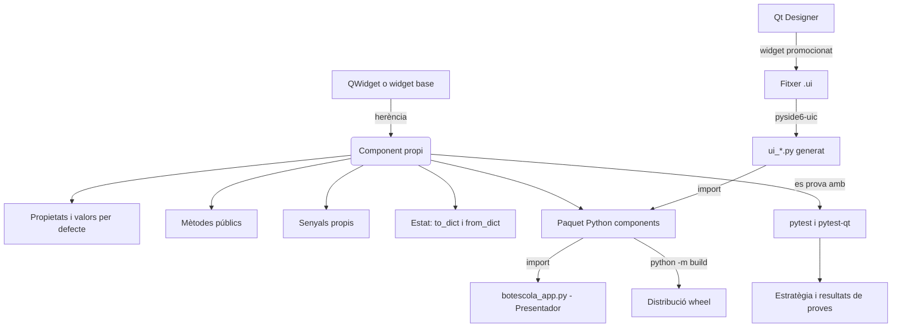
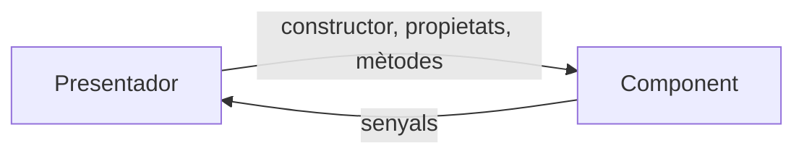

# Tema 2. Arquitectura de Components

## 1. Identificació

* **Mòdul:** 0488. Desenvolupament d'interfícies
* **Curs:** 1r CFGS de Desenvolupament d'Aplicacions Multiplataforma (DAM)
* **Tema:** 2. Arquitectura de Components
* **Durada presencial:** 12 hores
* **RA treballats:** RA3 (complet) i RA8 (parcialment: CA 8.1 i 8.7)
* **Prerequisits:** Qt Designer i bucle d'esdeveniments (Tema 1), **POO bàsica de Python** i ús bàsic de Git. Si aquesta base no és sòlida, completar abans `00_Reforç_POO_Python_per_PySide6.md`; no es pressuposa experiència prèvia creant classes Qt.
* **Projecte transversal:** **BotEscola Desktop**. Al Tema 1 el llistat de notificacions només mostra text. En aquest tema construïm dos components propis i reutilitzables: un `SelectorPrioritat` (exemple guiat) i una `TargetaNotificacio` (PAC 2) que mostra remitent, assumpte, data i estat de cada notificació. Els components es proven amb proves unitàries automàtiques, es documenten, s'empaqueten i s'integren a la finestra principal de BotEscola.

### Criteris d'avaluació treballats

#### RA3. Crea components visuals valorant i emprant eines específiques.

* CA 3.1: Identifica les eines per al disseny i prova de components.
* CA 3.2: Crea components visuals.
* CA 3.3: Defineix els seus mètodes i les seves propietats amb assignació de valors per defecte.
* CA 3.4: Determina els esdeveniments a què ha de respondre el component i se'ls ha associat les accions corresponents
* CA 3.5: Realitza proves unitàries sobre els components desenvolupats.
* CA 3.6: Documenta els components creats.
* CA 3.7: Empaqueta components.
* CA 3.8: Programa aplicacions la interfície gràfica de les quals utilitza els components creats.

#### Continguts Orientatius

* 3.1 Concepte de component; característiques.
* 3.2 Propietats, atributs i mètodes.
* 3.3 Esdeveniments; associació d'accions a esdeveniments.
* 3.4 Persistència del component.
* 3.5 Eines per al desenvolupament de components visuals.
* 3.6 Prova dels components.
* 3.7 Empaquetat de components.

#### RA8. Avalua el funcionament d'aplicacions dissenyant i executant proves.

* CA 8.1: Estableix una estratègia de proves.
* CA 8.2: Fa proves d'integració dels diferents elements.
* CA 8.3: Fa proves de regressió.
* CA 8.4: Realitza proves de volum i estrès.
* CA 8.5: Realitza proves de seguretat.
* CA 8.6: Fa proves d'ús de recursos per part de l'aplicació.
* CA 8.7: Documenta l'estratègia de proves i els resultats obtinguts.

#### Continguts Orientatius

* 8.1 Objectiu, importància i limitacions del procés de prova. Estratègies.
* 8.2 Proves d'integració: ascendents i descendents.
* 8.3 Proves de sistema: configuració, recuperació, entre altres.
* 8.4 Proves d'ús de recursos.
* 8.5 Proves de seguretat.
* 8.6 Proves manuals i automàtiques. Eines de programari per a la realització de proves.

> **Abast del tema:** els CA 8.2 a 8.6 (integració, regressió, volum i estrès, seguretat i ús de recursos) no es treballen en aquest tema, sinó que es veuran durant el Tema 5. Els criteris de disseny visual, usabilitat i accessibilitat (RA4) i l'ús d'editors visuals (RA1) treballats en el Tema 1 es mantenen, però sense convertir-los en pràctica d'avaluació d'aquest tema.

## 2. Introducció

En el desenvolupament de programari professional, la regla d'or és el principi **DRY** (_Don't Repeat Yourself_). Quan dissenyem aplicacions, és freqüent trobar conjunts d'elements visuals que funcionen com una única entitat lògica. Per exemple, un selector de color (amb els seus botons i un quadre de previsualització) o una targeta d'usuari (amb foto, nom i botó d'editar).

Copiar i enganxar aquests conjunts de controls múltiples vegades és un error arquitectònic greu: si el client demana canviar el disseny, hauràs d'anar pantalla per pantalla aplicant el canvi. La solució és **crear els nostres propis components**.

En aquest tema aprendrem a heretar de les classes base de Qt per construir components complexos. Definirem les seves propietats, crearem els nostres propis senyals (Custom Signals) i ens assegurarem que no es trenquen davant de futurs canvis escrivint **proves unitàries** específiques per a interfícies gràfiques, un pas crític en qualsevol entorn de producció seriós. Finalment, veurem com integrar aquests components creats amb codi dins del nostre estimat editor visual, Qt Designer, gràcies a la "promoció de widgets".

En acabat el tema, continuarem treballant en el projecte transversal **BotEscola Desktop** i crearem un component de targeta de notificació que encapsuli remitent, assumpte, data i estat, amb un botó per marcar com a llegit. Aquest component serà reutilitzable i provat automàticament amb proves unitàries. Amb això no només aconseguirem un codi més net i modular, sinó que també ens acostarem a les pràctiques professionals de desenvolupament d'interfícies gràfiques.

## 3. Objectius didàctics

En acabar el tema, l'alumne serà capaç de:

1. Comparar les eines per crear i provar components (subclasse en codi, widget promocionat, plugin de Designer, `QUiLoader`, `pytest-qt`, `unittest` amb `QTest`) i justificar l'elecció en un escenari concret. _(CA 3.1)_
2. Crear un component visual com a subclasse de `QWidget`, amb layouts interns i sense fitxer `.ui`. _(CA 3.2)_
3. Definir les propietats i els mètodes públics d'un component amb valors per defecte, validant els valors no admissibles, i desar-ne i restaurar-ne l'estat amb `to_dict()` i `from_dict()`. _(CA 3.3)_
4. Determinar els esdeveniments a què ha de respondre un component, definir els senyals propis que emet i associar-hi les accions corresponents. _(CA 3.4)_
5. Escriure i executar proves unitàries amb `pytest` i `pytest-qt` que verifiquin valors inicials, interacció simulada, senyals emesos i entrades no vàlides. _(CA 3.5)_
6. Documentar un component amb docstrings i amb una fitxa que descrigui la seva interfície pública. _(CA 3.6)_
7. Organitzar components en un paquet Python i generar-ne una distribució (`wheel`) que es pugui instal·lar en un altre entorn. _(CA 3.7)_
8. Utilitzar els components en una aplicació, per codi i com a widget promocionat a Qt Designer, regenerant el mòdul amb `pyside6-uic`. _(CA 3.8)_
9. Definir una estratègia de proves per a un component i documentar-ne els resultats amb la comanda, la sortida, les versions i les incidències. _(CA 8.1 i 8.7)_

## 4. Mapa conceptual



## 5. Conceptes fonamentals

### 5.0. Pont de POO: què necessitem per entendre un component

Abans de crear un component propi, hem de poder llegir una classe Python com aquesta:

```python
class SelectorPrioritat(QWidget):
    def __init__(self, parent=None):
        super().__init__(parent)
        self._prioritat = "Normal"

    def reiniciar(self):
        self._prioritat = "Normal"
```

Per entendre-la només necessitem:

| Concepte                   | En aquest tema                                                                                                |
| -------------------------- | ------------------------------------------------------------------------------------------------------------- |
| **Classe**                 | La plantilla del component (`SelectorPrioritat`).                                                             |
| **Instància**              | Un objecte concret creat amb `SelectorPrioritat()`.                                                           |
| **`self`**                 | Referència a la instància actual.                                                                             |
| **Constructor `__init__`** | Inicialitza l'objecte.                                                                                        |
| **Atribut**                | Dada que conserva l'estat, com `self._prioritat`.                                                             |
| **Mètode**                 | Operació que pot fer l'objecte, com `reiniciar()`.                                                            |
| **Herència**               | `SelectorPrioritat(QWidget)` reutilitza el comportament de `QWidget`.                                         |
| **`super()`**              | Permet inicialitzar la part heretada de `QWidget`.                                                            |
| **Composició**             | El component conté altres objectes Qt, com `QPushButton` i `QButtonGroup`.                                    |
| **Atribut de classe**      | Dada compartida per totes les instàncies, com la constant `NIVELLS`.                                          |
| **`@classmethod`**         | Mètode que rep la classe (`cls`) en lloc de la instància (`self`); s'utilitza a `_validar()` i `from_dict()`. |
| **Excepcions**             | `raise ValueError(...)` per rebutjar un valor no admès; `isinstance(...)` per comprovar un tipus.             |
| **`lambda`**               | Funció anònima curta; apareix a l'exercici C.                                                                 |

> **Regla didàctica:** si una línia de l'exemple guiat pressuposa un concepte de POO que no apareix aquí, consulta el document de reforç abans de memoritzar la sintaxi.

### 5.1. Concepte de component visual

Un **component** és una unitat reutilitzable que encapsula tres coses: una **estructura visual** (els controls interns i la seva disposició), un **estat** (les dades que guarda) i un **comportament** (com reacciona als esdeveniments). En Qt se sol anomenar _widget_; en altres entorns, com Windows Forms o WPF, se l'anomena _control_.

Un component pot ser des d'un simple botó fins a un reproductor de vídeo complet amb barra de progrés i controls de volum integrats. A nivell de programació, crear un component significa **heretar d'una classe existent** (generalment `QWidget` si ho fem des de zero, o de `QPushButton` si només volem modificar un botó) i afegir-hi la nostra lògica.

Segons com es construeix, es distingeixen tres tipus de component:

| Tipus                       | Com es crea                                                | Exemple a BotEscola                                    | Quan és adequat                                      |
| --------------------------- | ---------------------------------------------------------- | ------------------------------------------------------ | ---------------------------------------------------- |
| **Widget compost**          | Subclasse de `QWidget` amb un layout i widgets interns     | `SelectorPrioritat`, `TargetaNotificacio`              | Agrupar controls existents amb un comportament propi |
| **Widget especialitzat**    | Subclasse d'un widget concret (`QLineEdit`, `QPushButton`) | Camp de text que només accepta un número de port vàlid | Modificar el comportament d'un únic control          |
| **Widget amb pintat propi** | Subclasse que sobreescriu `paintEvent`                     | Indicador gràfic dibuixat a mà (ampliació)             | Aspecte que no es pot construir combinant widgets    |

En aquest tema treballarem sobretot amb **widgets compostos**.

### 5.2. Interfície pública: propietats, mètodes i valors per defecte

La **interfície pública** d'un component és el conjunt d'elements que l'exterior pot utilitzar: el constructor, les propietats, els mètodes i els senyals. Tot el que no forma part d'aquesta interfície (per exemple, els botons interns) es considera privat i, per convenció en Python, el nom comença per `_`.

En parlar de propietats convé distingir tres significats, perquè en Qt convivim amb tots tres:

| Concepte                | Què és                                                                                                          | Exemple                             |
| ----------------------- | --------------------------------------------------------------------------------------------------------------- | ----------------------------------- |
| **Propietat de Qt**     | Propietat registrada al sistema de meta-objectes de Qt; és la que mostra l'editor de propietats del Qt Designer | `enabled`, `toolTip`, `windowTitle` |
| **Propietat de Python** | Atribut accessible com a variable però controlat per un _getter_ i, opcionalment, un _setter_ (`@property`)     | `selector.prioritat`                |
| **Atribut d'instància** | Variable interna de l'objecte, sense control d'accés                                                            | `self._prioritat`                   |

Als nostres components exposarem l'estat amb **propietats de Python**: permeten validar el valor que s'assigna i decidir quan s'emet un senyal. Les propietats de Qt (`Property`) són una ampliació.

Un component ha de tenir sempre un **estat inicial vàlid**, encara que qui l'utilitza no passi cap paràmetre. Per això el constructor assigna valors per defecte i valida els valors rebuts. Hi ha una convenció important: `parent=None` és sempre el **primer** paràmetre del constructor, tal com fan els widgets de Qt. El motiu és tècnic i el veurem al punt 5.7: el codi que genera `pyside6-uic` crea els widgets promocionats passant-hi el pare com a primer argument.

### 5.3. Esdeveniments i senyals propis

En Qt hi ha dos mecanismes que sovint es confonen:

|                        | Senyal (`Signal`)                                           | Esdeveniment (`QEvent`)                                                                                               |
| ---------------------- | ----------------------------------------------------------- | --------------------------------------------------------------------------------------------------------------------- |
| **Nivell**             | Alt: "ha passat una cosa" (`clicked`, `prioritat_canviada`) | Baix: entrada o sistema (clic, tecla, canvi de mida, pintat)                                                          |
| **Com es rep**         | Connectant-lo a un slot (qualsevol funció o mètode)         | Sobreescrivint un handler virtual (`mousePressEvent`, `keyPressEvent`, `resizeEvent`) o amb un filtre d'esdeveniments |
| **Qui el genera**      | L'objecte que el declara, cridant `emit()`                  | El bucle d'esdeveniments de Qt                                                                                        |
| **Ús en un component** | Formen la interfície pública cap a l'exterior               | Són un detall intern; si l'exterior ho ha de saber, es converteix en un senyal                                        |

Fins ara hem consumit senyals que Qt ja ofereix (`clicked`, `textChanged`). Un component també pot **declarar senyals pròpies** per avisar de coses que només ell coneix. Per exemple, si dissenyem un component de "Selector de Prioritat" (Baixa, Normal, Alta), aquest ha d'emetre una senyal **pròpia** tipus `prioritat_canviada` enviant el nou valor. A PySide6 es fa amb `Signal(tipus)`, declarat **a nivell de classe**, i s'emet amb `emit()`.

Decidir quins esdeveniments atén un component és una tasca de disseny que es documenta amb una taula:

| Esdeveniment d'entrada          | Acció interna                       | Senyal de sortida                                   |
| ------------------------------- | ----------------------------------- | --------------------------------------------------- |
| L'usuari prem un botó de nivell | Actualitza `prioritat` i els botons | `prioritat_canviada(str)`, només si el valor canvia |

La regla d'or de la comunicació és que **la informació entra pel constructor, propietats i mètodes, i els avisos surten a través de senyals**:



Així el component no necessita conèixer la finestra on viu, i pot reutilitzar-se en qualsevol lloc.

### 5.4. Persistència de l'estat del component

La **persistència** és la capacitat de conservar l'estat del component més enllà de la seva vida en memòria. No es desen els widgets, sinó **les dades que defineixen el seu estat**. En treballem tres nivells:

1. **Estructura de dades pròpia** (aquest tema): el component ofereix `to_dict()`, que retorna un diccionari amb dades simples (text, números, booleans), i `from_dict()`, que crea un component a partir d'aquest diccionari. Aquest diccionari es pot convertir a JSON o passar a qualsevol altra capa.
2. **Preferències de l'usuari** amb `QSettings` (ampliació): per recordar coses com l'última prioritat triada entre execucions.
3. **Base de dades** (Tema 4): el component no accedeix directament a les dades; el Presentador les hi proporciona.

El criteri és que una prova pugui verificar l'anada i tornada: si es desa l'estat i es restaura, el resultat ha de ser idèntic.

### 5.5. Estructura i empaquetat de components

Per reutilitzar un component no n'hi ha prou amb tenir-lo en un fitxer. Cal distingir tres nivells:

| Terme           | Què és                                                                            | Exemple                                       |
| --------------- | --------------------------------------------------------------------------------- | --------------------------------------------- |
| **Mòdul**       | Un fitxer `.py`                                                                   | `components/selector.py`                      |
| **Paquet**      | Una carpeta de mòduls, amb un fitxer `__init__.py` que la identifica com a paquet | `components/`                                 |
| **Distribució** | El paquet empaquetat i versionat perquè es pugui instal·lar amb `pip`             | `botescola_components-0.1.0-py3-none-any.whl` |

Amb el paquet ja es pot fer `from components.selector import SelectorPrioritat`. La distribució permet instal·lar-lo en un altre projecte o entorn virtual. Per generar-la s'utilitza un fitxer `pyproject.toml`, que descriu el nom, la versió, les dependències i els paquets que s'inclouen:

```toml
[build-system]
requires = ["setuptools>=68"]
build-backend = "setuptools.build_meta"

[project]
name = "botescola-components"
version = "0.1.0"
description = "Components visuals reutilitzables de BotEscola Desktop"
requires-python = ">=3.10"
dependencies = ["PySide6"]

[tool.setuptools.packages.find]
include = ["components*"]
```

La línia `include` és necessària perquè a l'arrel del projecte també hi ha carpetes que **no** formen part del component (`ui/`, `generated/`, `tests/`); sense indicar què s'empaqueta, `setuptools` pot no saber-ho decidir i fallar.

> **Nota:** en una llibreria real triaríem un nom de paquet més específic (per exemple `botescola_components`) per evitar col·lisions amb altres paquets. Aquí mantenim `components` per simplicitat; és una limitació coneguda.

L'empaquetat d'aquest tema és el d'una **llibreria de components**. El d'una aplicació completa amb instal·lador (PyInstaller, Inno Setup) correspon al RA7 i es treballarà al Tema 5.

### 5.6. Eines per al desenvolupament i la prova de components

Escollir l'eina de desenvolupament concreta depèn de qui utilitzarà el component i com es distribuirà:

| Necessitat                            | Eina                                   | Avantatges                                                           | Limitacions                                                        |
| ------------------------------------- | -------------------------------------- | -------------------------------------------------------------------- | ------------------------------------------------------------------ |
| Crear el component                    | Subclasse de `QWidget` en Python       | Control total, fàcil de provar i versionar                           | No apareix a la paleta de Designer                                 |
| Usar-lo a Designer                    | **Widget promocionat**                 | No cal cap instal·lació                                              | Designer només mostra el widget base, no la vista prèvia real      |
| Usar-lo a Designer amb vista prèvia   | Plugin de Designer                     | El component apareix a la paleta                                     | Instal·lació i manteniment més complexos; fora de l'abast del tema |
| Carregar un `.ui` en temps d'execució | `QUiLoader` amb `registerCustomWidget` | No cal generar codi                                                  | Flux alternatiu al que seguim (generació amb `pyside6-uic`)        |
| Provar amb Qt                         | `pytest` + `pytest-qt`                 | Codi curt; `qtbot` simula ratolí i teclat; captura errors dels slots | Dependència externa                                                |
| Provar sense dependències             | `unittest` + `QTest`                   | Ve amb Python i Qt                                                   | Més verbós                                                         |
| Empaquetar                            | `setuptools` + `build`                 | Estàndard i molt documentat                                          | Alternatives: `hatchling`, `flit`, `poetry`                        |
| Documentar                            | Docstrings i fitxa en Markdown         | Sense eines addicionals                                              | El manual complet arriba al Tema 5 (MkDocs)                        |

Un component ha de garantir que sempre funciona igual. En comptes de provar-ho manualment prement botons a mà cada vegada que fem un canvi de codi, escriurem **proves unitàries** automatitzades.

Per a BotEscola utilitzarem **`pytest`** (el framework de proves molt utilitzat en Python) i **`pytest-qt`** (un connector que ens permet instanciar finestres sense bloquejar el sistema i disposa de l'eina `qtbot` per simular que un ratolí fa clic virtualment sobre el nostre component). També empaquetarem els components amb **`setuptools`** i els distribuirem com a **paquet Python**. La decisió obeeix a la necessitat de mantenir un flux coherent amb el Tema 1, sense haver d'instal·lar res a Designer i amb la possibilitat d'automatitzar les proves.

### 5.7. Widgets promocionats

Un component escrit en Python no apareix a la paleta de Qt Designer. Per situar-lo en un formulari s'utilitza la **promoció de widgets**:

1. A la finestra/formulari que estem dissenyant dins de Qt s'afegeix un `Widget` (de tipus `QWidget`) al lloc on ha d'anar el component, fent de _placeholder_.
2. Amb el botó dret, _Promote to…_ (Promocionar a…; Designer mostra els textos en anglès), s'indica el nom de la classe i el **mòdul Python** on es troba.
3. `pyside6-uic` afegeix al fitxer generat l'`import` del component i el crearà enlloc del widget base.

La promoció és una instrucció perquè el codi generat instanciï la classe pròpia en lloc del widget base. És diferent de carregar un `.ui` dinàmicament amb `QUiLoader`, on el widget personalitzat s'ha de registrar amb el loader. Tres conseqüències pràctiques:

* En una promoció utilitzada amb `pyside6-uic`, el camp _Header file_ (fitxer de capçalera) s'utilitza per indicar el mòdul que ha de generar-se a l'`import`. En el nostre exemple escriurem `components.selector`; no hi posarem ni el nom de la classe ni una ruta amb `/`. Designer pot mostrar-hi un `.h` al final (herència del món C++); `pyside6-uic` el tracta com a sufix i no el copia a l'`import`. **Comprova sempre la línia d'`import` real del fitxer `ui_*.py` generat**, perquè és la verificació definitiva.
* El codi generat crea el component passant-hi el pare com a **primer argument posicional** (`SelectorPrioritat(self.centralwidget)`). Per això `parent=None` ha de ser el primer paràmetre del constructor i la resta han de tenir valors per defecte.
* Al Editor de Propietats de Qt Widgets Designer només es veuen les propietats del widget base. Les propietats i els senyals propis s'utilitzen des del codi Python.

### 5.8. Proves unitàries de components i estratègia de proves

Una **prova unitària** verifica una peça petita de codi de manera aïllada i automàtica. Té tres parts (esquema _Arrange–Act–Assert_): es prepara l'escenari (per exemple, es crea el component), s'executa una acció (un clic simulat) i es comprova el resultat amb un `assert`.

`pytest` és l'eina que descobreix i executa les proves. Busca fitxers `test_*.py` i funcions `test_*`. `pytest-qt` hi afegeix el fixture **`qtbot`**, que:

* Proporciona la `QApplication` necessària sense haver d'iniciar el bucle amb `app.exec()`;
* Permet simular ratolí i teclat (`mouseClick`, `keyClick`);
* Permet esperar un senyal (`waitSignal`) o comprovar que no s'emet (`assertNotEmitted`);
* Tanca i elimina al final de cada prova els widgets registrats amb `addWidget`;
* Fa fallar la prova si hi ha excepcions dins d'un slot.

Què s'ha de provar en un component? El seu **contracte públic**: valors per defecte, canvis d'estat, senyals emesos (amb les dades que porten) i comportament davant d'entrades no vàlides. No es proven els detalls estètics (píxels, colors) ni el codi intern de Qt.

Una **estratègia de proves** és el pla que decideix què es prova, com, amb quines eines i quan es considera acceptable el resultat. Té limitacions que convé conèixer: una prova que passa no demostra que no hi hagi errors, només que aquell cas funciona; les proves automàtiques no substitueixen les manuals per a aspectes visuals i d'usabilitat; i unes proves massa lligades als detalls interns es trenquen en refactoritzar. Aquest tema treballa les proves **unitàries automàtiques** i les **manuals d'integració** sobre un component; les altres modalitats (integració, regressió, volum, estrès, seguretat i recursos) s'aborden al Tema 5.

## 6. Entorn de treball

### 6.1. Estructura del projecte

Partim del projecte BotEscola del Tema 1 i hi afegim els paquets `components/` i `tests/`, la documentació dels components i els fitxers de configuració:

```
botescola/
├── ui/
│   └── botescola.ui
├── generated/
│   └── ui_botescola.py
├── components/               <-- RA3: components reutilitzables (paquet)
│   ├── __init__.py
│   ├── selector.py
│   ├── targeta.py
│   ├── interruptor.py        <-- exercici D
│   └── comptador.py          <-- exercici E
├── tests/                    <-- RA8: proves unitàries
│   ├── test_selector.py
│   ├── test_targeta.py
│   ├── test_interruptor.py
│   └── test_comptador.py
├── docs/
│   └── components.md         <-- documentació dels components (CA 3.6)
├── botescola_app.py
├── pyproject.toml
├── pytest.ini
└── README.md
```

La carpeta `components/` no conté cap fitxer `.ui` ni depèn de `generated/`: un component ha de poder funcionar sense l'aplicació on s'utilitza.

### 6.2. Dependències

Amb l'entorn virtual del Tema 1 activat, instal·la les eines de prova i d'empaquetat:

```bash
python -m pip install pytest pytest-qt build
```

* `pytest` i `pytest-qt`: execució de les proves i fixture `qtbot`.
* `build`: generació de la distribució del paquet a partir de `pyproject.toml`.

Comprova les versions amb les quals treballes, perquè s'han de registrar a l'informe de proves (CA 8.7):

```bash
python -c "import sys, PySide6; print(sys.version.split()[0], PySide6.__version__)"
python -m pytest --version
```

### 6.3. Configuració de `pytest`

Crea el fitxer `pytest.ini` a l'arrel del projecte:

```ini
[pytest]
qt_api = pyside6
pythonpath = .
testpaths = tests
```

* `qt_api = pyside6` indica a `pytest-qt` quina llibreria ha d'utilitzar, encara que n'hi hagi d'altres instal·lades.
* `pythonpath = .` afegeix l'arrel del projecte a la ruta d'importació. Sense aquesta línia, les proves poden fallar amb `ModuleNotFoundError: No module named 'components'`.
* `testpaths = tests` limita la cerca de proves a la carpeta `tests/`.

Executa les proves des de l'arrel del projecte:

```bash
python -m pytest -v
```

> **Nota (Linux i servidors sense pantalla):** si les proves s'executen sense entorn gràfic, cal definir `QT_QPA_PLATFORM=offscreen` abans d'executar `pytest`. A Windows i macOS amb escriptori no cal.

### 6.4. Generació de la distribució

Un cop existeixi `pyproject.toml` (vegeu 5.5), des de l'arrel del projecte:

```bash
python -m build
```

Es crea la carpeta `dist/` amb dos fitxers: un `.whl` (_wheel_, format instal·lable) i un `.tar.gz` (codi font). (`python -m build` crea un entorn aïllat i hi descarrega `setuptools`: la primera vegada cal connexió a Internet.)

Per comprovar que la distribució funciona, instal·la el `.whl` en un **entorn virtual nou** i importa'n el component:

```bash
python -m venv .venv-prova
.venv-prova\Scripts\Activate.ps1
python -m pip install dist/botescola_components-0.1.0-py3-none-any.whl
python -c "from components import SelectorPrioritat; print('OK')"
```

(A Linux/macOS, l'activació és `source .venv-prova/bin/activate`.)

## 7. Exemple guiat: Component Selector de Prioritat

El nostre formulari requerirà que l'usuari assigni ràpidament una prioritat a una notificació per mitjà de tres botons que funcionin de manera excloent (només un actiu). Donat que aquest selector es pot necessitar a la finestra principal, en un diàleg de configuració o en una futura pantalla de filtres, encapsularem el mateix en un component propi anomenat `SelectorPrioritat`.

### Pas 1. Dissenyar la interfície pública abans de programar

Abans d'escriure codi, decidim què veu l'exterior del component:

| Element     | Nom                                                  | Tipus                        | Descripció                                                              |
| ----------- | ---------------------------------------------------- | ---------------------------- | ----------------------------------------------------------------------- |
| Constructor | `SelectorPrioritat(parent=None, prioritat="Normal")` | —                            | `parent` és el primer paràmetre; el nivell inicial té valor per defecte |
| Propietat   | `prioritat`                                          | `str` (lectura i escriptura) | Nivell actual; ha de ser un valor de `NIVELLS`                          |
| Constant    | `NIVELLS`                                            | `tuple[str]`                 | Valors admesos: `("Baixa", "Normal", "Alta")`                           |
| Senyal      | `prioritat_canviada(str)`                            | `Signal(str)`                | S'emet **només si el valor canvia**                                     |
| Mètodes     | `to_dict()` / `from_dict(dades)`                     | —                            | Desa i restaura l'estat                                                 |

I la taula d'esdeveniments del component (CA 3.4):

| Esdeveniment                                      | Acció interna                           | Senyal de sortida                                    |
| ------------------------------------------------- | --------------------------------------- | ---------------------------------------------------- |
| L'usuari prem un dels tres botons                 | Actualitza `prioritat` i el botó marcat | `prioritat_canviada(nivell)` si el valor és diferent |
| El programa assigna `selector.prioritat = "Alta"` | Marca el botó corresponent              | `prioritat_canviada("Alta")` si el valor és diferent |
| Es prem el botó que ja estava marcat              | Cap                                     | Cap                                                  |
| S'assigna un valor no admès                       | Rebutja el canvi                        | Cap; llança `ValueError`                             |

### Pas 2. Programar el component (`components/selector.py`)

```python
"""Selector de prioritat de tres nivells per a BotEscola."""

from PySide6.QtCore import Signal
from PySide6.QtWidgets import QButtonGroup, QHBoxLayout, QPushButton, QWidget


class SelectorPrioritat(QWidget):
    """Selector exclusiu de prioritat (Baixa, Normal, Alta).

    Senyals:
        prioritat_canviada(str): s'emet quan canvia el nivell, amb el nou valor.
    """

    NIVELLS = ("Baixa", "Normal", "Alta")

    # Els senyals es declaren a nivell de classe, mai dins de __init__.
    prioritat_canviada = Signal(str)

    # Constructor amb valors per defecte i validació d'entrada.
    def __init__(self, parent=None, prioritat="Normal"):
        """Crea el selector.

        Args:
            parent: widget pare (opcional).
            prioritat: nivell inicial; ha de ser un valor de NIVELLS.

        Raises:
            ValueError: si `prioritat` no és un nivell admès.
        """
        super().__init__(parent)
        self._prioritat = self._validar(prioritat)

        self._botons = {}
        self._grup = QButtonGroup(self)
        # Per defecte QButtonGroup ja és exclusiu, però és bona pràctica explicitar-ho.
        self._grup.setExclusive(True)

        layout = QHBoxLayout(self)
        layout.setContentsMargins(0, 0, 0, 0)

        for index, nivell in enumerate(self.NIVELLS):
            boto = QPushButton(nivell)
            boto.setCheckable(True)
            boto.setObjectName(f"btn_{nivell.lower()}")
            boto.setToolTip(f"Prioritat {nivell.lower()}")
            self._grup.addButton(boto, index)
            layout.addWidget(boto)
            self._botons[nivell] = boto

        self._botons[self._prioritat].setChecked(True)
        self._grup.idClicked.connect(self._on_boto_premut)

    # Validació interna: només necessita la constant de classe NIVELLS, no l'estat
    # de cap instància; per això rep `cls` (@classmethod) i no `self`.
    @classmethod
    def _validar(cls, valor):
        if valor not in cls.NIVELLS:
            raise ValueError(
                f"Prioritat no vàlida: {valor!r}. Valors admesos: {cls.NIVELLS}"
            )
        return valor

    @property
    def prioritat(self):
        """Nivell de prioritat actual."""
        return self._prioritat

    @prioritat.setter
    def prioritat(self, valor):
        valor = self._validar(valor)
        # Si el valor no ha canviat, no fem res (no emetem senyal).
        if valor == self._prioritat:
            return
        self._prioritat = valor
        # Al marcar el botó, es desmarca automàticament l'anterior, gràcies a QButtonGroup.
        self._botons[valor].setChecked(True)
        # Disparem el senyal de prioritat canviada amb el nou valor.
        self.prioritat_canviada.emit(valor)

    # Aquest mètode sí que necessita `self`: treballa amb l'estat de la instància.
    def _on_boto_premut(self, index):
        """Slot intern: tradueix el botó premut a un canvi de prioritat."""
        self.prioritat = self.NIVELLS[index]

    # Constructor alternatiu: rep `cls` i no `self`, de manera que en una subclasse
    # crea una instància de la subclasse i no pas de SelectorPrioritat.
    @classmethod
    def from_dict(cls, dades, parent=None):
        """Crea un selector a partir d'un diccionari creat per `to_dict()`."""
        return cls(parent, dades.get("prioritat", "Normal"))

    def to_dict(self):
        """Retorna l'estat del component com a diccionari de dades simples."""
        return {"prioritat": self._prioritat}

```

I el fitxer `components/__init__.py`, que fa que la carpeta sigui un paquet i n'exposa els components:

```python
"""Components visuals reutilitzables de BotEscola Desktop."""

from .selector import SelectorPrioritat

__all__ = ["SelectorPrioritat"]
__version__ = "0.1.0"
```

(Cada component nou que afegeixis —`TargetaNotificacio`, `InterruptorEstat`, `ComptadorPendents`— s'ha d'importar aquí i afegir a `__all__`.)

### Pas 3. Prova visual ràpida

Abans d'automatitzar res, comprova que el component es veu i respon. Crea un fitxer `prova_selector.py` fora de `components/`:

```python
import sys

from PySide6.QtWidgets import QApplication

from components import SelectorPrioritat

app = QApplication(sys.argv)
selector = SelectorPrioritat()
selector.prioritat_canviada.connect(lambda nivell: print("Nova prioritat:", nivell))
selector.show()
sys.exit(app.exec())
```

Prem els botons i observa la consola. Aquesta és una prova **manual**; al Pas 5 la convertirem en prova automàtica.

### Pas 4. Utilitzar-lo a Qt Designer (widget promocionat)

1. Executa `pyside6-designer` i crea un formulari de tipus **Widget**.
2. Afegeix un `QLabel` amb el text `Prioritat:` i, al costat, un `QWidget` (categoria _Containers_) amb `objectName` `selector_prioritat`.
3. Fes clic dret sobre aquest `QWidget` → **Promote to…** i omple:
   * **Base class name:** `QWidget`
   * **Promoted class name:** `SelectorPrioritat`
   * **Header file:** `components.selector`
   * Deixa desmarcada l'opció _Global include_.
4. Prem **Add** i després **Promote**.
5. Aplica un layout horitzontal al formulari i desa'l com `ui/prova_selector.ui`.
6. Genera el mòdul Python:

```bash
pyside6-uic ui/prova_selector.ui -o generated/ui_prova_selector.py
```

7. Obre `generated/ui_prova_selector.py` **només per llegir-lo** i localitza aquestes dues línies:

```python
from components.selector import SelectorPrioritat
...
self.selector_prioritat = SelectorPrioritat(Form)
```

La primera és l'importació derivada del camp _Header file_; la segona crea el component passant-hi el pare com a **primer argument**. Per això `parent` és el primer paràmetre del constructor.

8. Utilitza el component des d'`app.py`:

```python
import sys

from PySide6.QtWidgets import QApplication, QWidget

from generated.ui_prova_selector import Ui_Form


class Finestra(QWidget):
    def __init__(self):
        super().__init__()
        self.ui = Ui_Form()
        self.ui.setupUi(self)
        self.ui.selector_prioritat.prioritat_canviada.connect(self.mostrar_prioritat)

    def mostrar_prioritat(self, nivell):
        print(f"Prioritat seleccionada: {nivell}")


if __name__ == "__main__":
    app = QApplication(sys.argv)
    finestra = Finestra()
    finestra.show()
    sys.exit(app.exec())
```

Observa que `Finestra` només coneix el senyal i la propietat del component; no sap com està construït per dins.

### Pas 5. Proves unitàries (`tests/test_selector.py`)

```python
import pytest
from PySide6.QtCore import Qt
from PySide6.QtWidgets import QPushButton

from components import SelectorPrioritat


def boto(selector, nom):
    """Localitza un botó intern pel seu objectName."""
    return selector.findChild(QPushButton, nom)


def test_valor_per_defecte(qtbot):
    selector = SelectorPrioritat()
    qtbot.addWidget(selector)

    assert selector.prioritat == "Normal"
    assert boto(selector, "btn_normal").isChecked()
    assert not boto(selector, "btn_alta").isChecked()


def test_clic_canvia_prioritat_i_emet_senyal(qtbot):
    selector = SelectorPrioritat()
    qtbot.addWidget(selector)

    with qtbot.waitSignal(selector.prioritat_canviada, timeout=1000) as blocker:
        qtbot.mouseClick(boto(selector, "btn_alta"), Qt.MouseButton.LeftButton)

    assert blocker.args == ["Alta"]
    assert selector.prioritat == "Alta"
    assert boto(selector, "btn_alta").isChecked()
    assert not boto(selector, "btn_normal").isChecked()


def test_no_emet_senyal_si_no_canvia(qtbot):
    selector = SelectorPrioritat()
    qtbot.addWidget(selector)

    with qtbot.assertNotEmitted(selector.prioritat_canviada):
        qtbot.mouseClick(boto(selector, "btn_normal"), Qt.MouseButton.LeftButton)


def test_valor_no_valid_es_rebutja(qtbot):
    selector = SelectorPrioritat()
    qtbot.addWidget(selector)

    with pytest.raises(ValueError):
        selector.prioritat = "Urgent"
    assert selector.prioritat == "Normal"

    with pytest.raises(ValueError):
        SelectorPrioritat(prioritat="Urgent")


def test_persistencia_anada_i_tornada(qtbot):
    original = SelectorPrioritat(prioritat="Alta")
    qtbot.addWidget(original)

    copia = SelectorPrioritat.from_dict(original.to_dict())
    qtbot.addWidget(copia)

    assert copia.prioritat == "Alta"
    assert copia.to_dict() == original.to_dict()
```

Executa `python -m pytest -v`. Han d'aparèixer cinc proves amb `PASSED`.

**Prova de sensibilitat (obligatòria):** canvia temporalment una línia de `selector.py` (per exemple, treu l'`emit()` del _setter_) i torna a executar les proves. Han de fallar. Si una prova no falla quan el codi és incorrecte, no verifica res. Després restaura el codi.

### Pas 6. Documentar el component

La documentació té dos nivells (CA 3.6):

1. **Docstrings** dins del codi, com les que has vist al Pas 2: què fa la classe, quins senyals emet i, a cada mètode, els arguments i les excepcions.
2. **Fitxa del component** a `docs/components.md`, pensada per a qui l'utilitzi sense llegir-ne el codi:

```markdown

## SelectorPrioritat

**Propòsit:** seleccionar una de tres prioritats de manera exclusiva.
**Mòdul:** `components.selector` · **Hereta de:** `QWidget`

### Constructor
`SelectorPrioritat(parent=None, prioritat="Normal")`

### Propietats
| Nom | Tipus | Valor per defecte | Descripció |
|---|---|---|---|
| `prioritat` | `str` | `"Normal"` | Nivell actual. `ValueError` si no és a `NIVELLS`. |

### Senyals
| Nom | Paràmetres | Quan s'emet |
|---|---|---|
| `prioritat_canviada` | `str` | Quan el nivell canvia (per clic o per codi). |

### Ús
    selector = SelectorPrioritat()
    selector.prioritat_canviada.connect(handler)

### Proves
`tests/test_selector.py` (5 proves).
```

## 8. Anàlisi tècnica

Un cop funciona, cal ser capaç d'explicar-ho i modificar-ho.

**Estructura de la classe**

* `SelectorPrioritat(QWidget)` és un **widget compost**: no dibuixa res per si mateix, sinó que conté un layout amb tres `QPushButton`.
* `NIVELLS` és una constant de classe: és l'únic lloc on es defineixen els valors admesos. Afegir un nivell implica canviar una sola línia (vegeu l'exercici B).
* `_botons` i `_grup` són atributs **privats** (prefix `_`): l'exterior no ha de dependre'n.

**Propietats i valors per defecte**

* `prioritat` és una propietat de Python (`@property`). El _setter_ valida el valor, evita canvis redundants i és l'únic lloc on s'emet el senyal. Així, un clic i una assignació per codi tenen exactament el mateix comportament.
* `prioritat="Normal"` és el valor per defecte, i `parent=None` va **primer** perquè el codi generat per `pyside6-uic` el passa com a primer argument (Pas 4).
* El constructor valida `prioritat` abans de construir els botons i el layout: si el valor és incorrecte, llança `ValueError` i el component no arriba a quedar en un estat invàlid.

**Senyals i esdeveniments**

* `prioritat_canviada = Signal(str)` es declara **a la classe**: Qt necessita el senyal com a atribut de classe per associar-lo a cada instància. Declarat dins de `__init__` (`self.x = Signal(str)`) no funciona.
* `QButtonGroup` amb `setExclusive(True)` garanteix que només hi ha un botó marcat. Abans d'utilitzar-lo, cal programar-ho manualment i és fàcil deixar dos botons marcats.
* `idClicked` envia l'identificador del botó premut; el component el tradueix a un nivell. Alternativa: connectar cada botó amb una funció `lambda`. En aquest cas cal escriure `lambda _checked=False, n=nivell: ...`; sense el paràmetre `n=nivell`, en un bucle totes les `lambda` retindrien l'últim valor de `nivell` (vegeu l'exercici C).

**Comunicació amb l'exterior**

* El component rep dades pel constructor i la propietat, i avisa amb el senyal. No coneix `botescola_app.py` ni cap finestra: el Presentador és qui decideix què fer amb el canvi.

**Persistència**

* `to_dict()` retorna dades simples (un `str`) i `from_dict()` les converteix de nou en component. El diccionari es pot convertir a JSON o passar a una base de dades sense arrossegar cap objecte de Qt.

**Proves**

* `qtbot.addWidget()` fa que `pytest-qt` tanqui i elimini el widget en acabar la prova.
* `findChild(QPushButton, "btn_alta")` localitza el botó pel `objectName`, tal com al Tema 1 utilitzàvem els noms per localitzar controls.
* `waitSignal` ha d'estar **al voltant** de l'acció que provoca el senyal; el `blocker.args` conté els paràmetres emesos.
* `assertNotEmitted` prova un comportament negatiu, que és tan important com el positiu.

## 9. Exercicis progressius

Tots els exercicis es lliuren a través d'un repositori de GitHub, amb el codi font i les captures que s'indiquin. Els fitxers generats per `pyside6-uic` s'inclouen, però no es modifiquen manualment.

**Ús de la IA:** pots utilitzar-la per consultar documentació o per explicar un error, però has de ser capaç de justificar cada línia del que lliures i de modificar-la sense ajuda. A l'exercici D, com a mínim, has de deixar constància (en un comentari o al README) de quines decisions de disseny has pres tu i per què.

### Exercici A — Reproducció

Crea l'estructura de carpetes de l'apartat 6.1 i reprodueix `components/__init__.py`, `components/selector.py` i `tests/test_selector.py`. Configura `pytest.ini` i executa `python -m pytest -v`.

**Lliurament:** captura de la sortida amb les cinc proves en `PASSED` i captura de la prova de sensibilitat (una prova fallant després de trencar el codi a propòsit).

### Exercici B — Modificació

Afegeix un quart nivell, `"Crítica"`, al `SelectorPrioritat`.

1. Modifica el component canviant el mínim possible. Justifica per què n'hi ha prou amb canviar `NIVELLS`.
2. Afegeix una prova que verifiqui que en prémer `Crítica` s'emet `"Crítica"`.
3. Converteix les proves de clic en una única prova amb `@pytest.mark.parametrize` (https://docs.pytest.org/en/stable/how-to/parametrize.html) que recorri els quatre nivells.
4. **Pista de disseny:** el component genera l'`objectName` amb `nivell.lower()`; amb `Crítica` en resulta `btn_crítica` (amb accent). Decideix com localitzaràs aquest botó a la prova i justifica la decisió.

**Lliurament:** codi modificat, proves i una frase que expliqui quina part del codi no ha calgut tocar i per què.

### Exercici C — Diagnosi

Cada un dels tres casos següents falla. Per a cadascun, indica el símptoma, la causa i la correcció, i comprova-ho executant el codi.

**Cas 1.** Un company té el component a `components/barra_cerca.py` (classe `BarraCerca`). Quan executa l'aplicació, obté `ModuleNotFoundError: No module named 'BarraCerca'`. Al fitxer generat hi apareix:

```python
from BarraCerca import BarraCerca
```

Quin camp del diàleg _Promote to…_ està mal omplert i quin valor exacte hi ha d'escriure?

**Cas 2.** Un component defineix el senyal així i falla en connectar-lo:

```python
class Cercador(QWidget):
    def __init__(self, parent=None):
        super().__init__(parent)
        self.text_canviat = Signal(str)
```

```python
cercador.text_canviat.connect(handler)   # AttributeError
```

**Cas 3.** Aquest codi hauria d'emetre el nivell corresponent en prémer cada botó, però en prémer qualsevol botó s'emet sempre `"Alta"`:

```python
for nivell in ("Baixa", "Normal", "Alta"):
    boto = QPushButton(nivell)
    boto.clicked.connect(lambda: self.set_prioritat(nivell))
    layout.addWidget(boto)
```

Explica per què passa i proposa dues correccions: una amb `lambda` i una sense.

**Lliurament:** un document breu (Markdown) amb els tres diagnòstics i el codi corregit.

### Exercici D — Repte

Crea el component `InterruptorEstat` al paquet `components/`. Ha de permetre triar entre dos estats, "Actiu" i "Inactiu".

Requisits mínims:

* utilitza dos `QRadioButton` dins d'un layout;
* emet un senyal `estat_canviat` amb un booleà (`True` = actiu);
* té un estat inicial vàlid encara que no se li passi cap paràmetre;
* inclou docstrings.

**No hi ha instruccions pas a pas.** Has de decidir: la interfície pública (nom de la propietat, valor per defecte, mètodes), si s'emet el senyal quan es torna a triar el mateix estat, si cal validar alguna entrada i com es persisteix l'estat. Escriu les proves que justifiquin cada decisió.

**Lliurament:** `components/interruptor.py`, `tests/test_interruptor.py` (mínim quatre proves) i una fitxa a `docs/components.md`.

### Exercici E — Aplicació al projecte

BotEscola ha de mostrar quantes notificacions queden pendents. Crea el component `ComptadorPendents`, una subclasse de `QLabel` (**widget especialitzat**), amb:

* constructor `ComptadorPendents(parent=None, total=0)` (recorda: `parent` va primer);
* una propietat `total` (enter, valor per defecte 0; llança `ValueError` si és negatiu);
* un text que depèn del valor: `Cap notificació pendent`, `1 notificació pendent` o `N notificacions pendents`;
* un senyal `sense_pendents` que s'emet quan `total` passa a 0.

Escriu-ne les proves amb `@pytest.mark.parametrize` per als casos 0, 1 i 5, i una prova per al valor negatiu.

**Lliurament:** component, proves i captura de la seva execució.

### Exercici F — Anàlisi de tecnologies

L'equip de BotEscola vol reutilitzar el mateix `SelectorPrioritat` en dues aplicacions diferents de l'escola, mantingudes per persones diferents. Compara, en un text de 8 a 12 línies, tres opcions: (1) copiar el fitxer `selector.py` a cada projecte, (2) distribuir-lo com a paquet instal·lable i utilitzar-lo com a widget promocionat, i (3) crear un plugin per a Qt Designer. Recomana una opció i justifica-la en termes de manteniment, versionat, instal·lació i prova.

## 10. Errors habituals

| Símptoma                                                                                 | Causa probable                                                                                                                               | Solució                                                                                                         | Prevenció                                                                       |
| ---------------------------------------------------------------------------------------- | -------------------------------------------------------------------------------------------------------------------------------------------- | --------------------------------------------------------------------------------------------------------------- | ------------------------------------------------------------------------------- |
| `AttributeError` en fer `connect` sobre un senyal propi (l'objecte és de tipus `Signal`) | El senyal s'ha declarat dins de `__init__` amb `self.`                                                                                       | Mou la declaració a nivell de classe, a sota del nom de la classe                                               | Declara tots els senyals just després de la definició de la classe              |
| `ModuleNotFoundError: No module named 'BarraCerca'` en executar l'aplicació              | Al diàleg _Promote to…_, _Header file_ conté el nom de la classe                                                                             | Escriu la ruta del mòdul amb punts: `components.barra_cerca`, i regenera amb `pyside6-uic`                      | Llegeix la línia d'`import` que apareix al fitxer `ui_*.py` generat             |
| `SyntaxError` en importar `ui_*.py`                                                      | _Header file_ s'ha escrit amb barres (`components/selector`)                                                                                 | Substitueix les barres per punts: `components.selector`                                                         | Comprova l'`import` generat                                                     |
| `ModuleNotFoundError: No module named 'components'` en executar `pytest`                 | L'arrel del projecte no està a la ruta d'importació                                                                                          | Afegeix `pythonpath = .` a `pytest.ini` o executa `python -m pytest` des de l'arrel                             | Inclou `pytest.ini` al repositori                                               |
| El fitxer de proves no s'executa o `pytest` no en troba cap                              | El fitxer o les funcions no segueixen la nomenclatura (`test_*.py` o `*_test.py`; funcions `test_*`), o no estan dins de `testpaths`         | Reanomena fitxers i funcions                                                                                    | Executa `python -m pytest --collect-only` per veure què descobreix              |
| El component es mostra amb mida zero o amb controls superposats                          | Els controls interns no estan dins d'un layout                                                                                               | Crea un layout amb `QHBoxLayout(self)` (o el que correspongui) i afegeix-hi els controls                        | No posicionis controls sense layout; comprova el component sol amb `prova_*.py` |
| `TypeError` o el component rep el widget pare com a dada (`remitent` és un `QWidget`)    | El constructor no té `parent` com a primer paràmetre; el codi generat el passa en primera posició                                            | Reordena: `__init__(self, parent=None, ...)`                                                                    | Mantén sempre `parent=None` primer, com fan els widgets de Qt                   |
| La prova falla amb `TimeoutError` de `waitSignal`                                        | L'acció que provoca el senyal és fora del bloc `with`, o el senyal no s'emet                                                                 | Posa `mouseClick` dins del `with`; comprova que l'acció fa realment el canvi                                    | Escriu primer el cas fallit (prova de sensibilitat)                             |
| Totes les `lambda` d'un bucle utilitzen l'últim valor                                    | Les `lambda` capturen la variable, no el valor (_late binding_)                                                                              | Fixa el valor: `lambda _c=False, n=nivell: ...`, o usa `functools.partial`, o `QButtonGroup` amb identificadors | No connectis `lambda` dins d'un bucle sense fixar el valor                      |
| `python -m build` falla amb `Multiple top-level packages discovered`                     | `setuptools` troba `ui/`, `generated/`, `tests/`... i no sap quins empaquetar                                                                | Afegeix a `pyproject.toml`: `[tool.setuptools.packages.find]` amb `include = ["components*"]`                   | Defineix explícitament què s'empaqueta                                          |
| `QWidget: Must construct a QApplication before a QWidget` en una prova                   | El widget es crea fora d'una prova, o sense `qtbot`                                                                                          | Crea els components dins de les proves i demana la fixture `qtbot`                                              | No instanciïs widgets a nivell de mòdul                                         |
| L'element seleccionat de la llista no es veu quan conté una targeta                      | El fons del widget de la targeta (per exemple, per la regla `QWidget { background-color }` del Tema 1) pot tapar el ressaltat de la selecció | Dona al component un fons transparent des del `.qss` i comprova la selecció amb ratolí i amb teclat             | Prova la selecció i el focus visibles abans de donar la integració per acabada  |

## 11. Bones pràctiques

* **Interfície pública petita i documentada.** Tot el que no cal que l'exterior utilitzi és privat (`_nom`). El que és públic es documenta i es prova.
* **Un component no coneix l'aplicació.** No importa `botescola_app`, no crida mètodes de la finestra pare, no llegeix variables globals. Rep dades i emet senyals.
* **Estat inicial vàlid.** Valors per defecte coherents i validació de les entrades. Un valor invàlid s'ha de rebutjar amb una excepció clara, no acceptar-lo en silenci.
* **Senyals amb nom d'esdeveniment i dades mínimes.** `prioritat_canviada(str)` és millor que `canvi(object)`. Emet només quan hi ha un canvi real.
* **`parent=None` primer al constructor.** Facilita la promoció al Designer i és coherent amb els widgets de Qt.
* **Nomenclatura.** Classes en `CamelCase`; mètodes, propietats i senyals en `snake_case`; `objectName` amb prefix de tipus (`btn_`, `lbl_`) tal com al Tema 1.
* **Sempre amb layouts.** Cap coordenada absoluta, ni tan sols dins d'un component petit.
* **Accessibilitat des de l'origen.** L'estat no depèn només del color (per exemple, la targeta mostra el text "Nova" o "Llegida"); els botons tenen text clar i `toolTip`; si el text visible no és prou descriptiu, s'assigna `setAccessibleName`. Els colors i la tipografia no es fixen dins del component: els hereta del full d'estil de l'aplicació, de manera que un canvi de paleta no obliga a tocar els components.
* **Les proves verifiquen el contracte, no la implementació.** Prova valors, senyals i errors; no depenguis de l'ordre intern dels widgets. Per localitzar controls interns, utilitza `objectName`.
* **Una prova ha de poder fallar.** Comprova-ho trencant el codi a propòsit.
* **No editis mai el codi generat.** Els components es promocionen i s'integren; el fitxer `ui_*.py` es regenera.
* **Versiona el paquet.** Cada canvi de la interfície pública implica actualitzar la versió a `pyproject.toml` i el `__version__` del paquet.

## 12. PAC 2: Component `TargetaNotificacio` i integració a BotEscola

### Context

Al panell esquerre de BotEscola (Tema 1), cada notificació es mostrava com un text a `QListWidget`. La direcció vol veure, de cada notificació, qui l'envia, quin és l'assumpte, quan s'ha rebut i si ja s'ha llegit, i poder marcar-la com a llegida directament des de la llista. A més, cada notificació tindrà una prioritat editable.

Aquests elements es repeteixen a cada fila, per això s'encapsulen en un component.

### Requisits funcionals

**Component `TargetaNotificacio` (`components/targeta.py`)**

1. Hereta de `QWidget` i es construeix **només amb codi** (sense fitxer `.ui`), amb layouts interns.
2. Constructor: `TargetaNotificacio(parent=None, id_notificacio=0, remitent="", assumpte="", data="", llegida=False)`.
3. Mostra remitent, assumpte, data i un text d'estat (`Nova` o `Llegida`). L'assumpte ha de poder ocupar més d'una línia si és llarg (`setWordWrap(True)`). Els controls interns tenen `objectName` `lbl_remitent`, `lbl_assumpte`, `lbl_data` i `lbl_estat`: les proves els localitzen amb `findChild`.
4. Conté un botó `Marcar com a llegida` (`objectName` `btn_llegit`) que, en prémer-lo:
   * passa la targeta a l'estat llegida (el text d'estat canvia i el botó es desactiva);
   * emet **una sola vegada** el senyal `llegit_clicat(int)` amb l'identificador de la notificació.
5. Exposa, com a propietats **de només lectura**, almenys `llegida`, `id_notificacio`, `remitent`, `assumpte` i `data`.
6. `to_dict()` retorna un diccionari amb aquestes cinc dades, i `from_dict(dades, parent=None)` crea una targeta a partir d'aquest.
7. Si `remitent` o `assumpte` no són text (`str`), el constructor llança `TypeError`.

> **Decisió de disseny:** el senyal transporta l'**identificador** de la notificació i no l'assumpte, perquè dues notificacions poden tenir el mateix assumpte i el Presentador ha de saber quina s'ha marcat.

**Component `SelectorPrioritat` a la finestra principal**

8. Afegeix al panell de detall de `ui/botescola.ui` un `SelectorPrioritat` com a **widget promocionat**, amb `objectName` `selector_prioritat`, i regenera `generated/ui_botescola.py`.
9. En seleccionar una notificació, el selector mostra la seva prioritat. En canviar-la, es desa a l'estructura de dades i s'actualitza el missatge d'estat.

**Integració a `botescola_app.py`**

10. La llista mostra cada notificació amb una `TargetaNotificacio` (per exemple amb `QListWidgetItem`, `setSizeHint` i `setItemWidget`). En seleccionar-ne una, continua apareixent el detall.
11. En marcar una targeta com a llegida, el Presentador actualitza les seves dades i mostra un missatge d'estat que inclou el remitent.
12. **Component de l'exercici E:** `ComptadorPendents` mostra el nombre de notificacions no llegides i s'actualitza en marcar-ne una com a llegida.

### Requisits no funcionals

* Els components no importen res de `botescola_app` ni de `generated/`.
* Tots els mètodes i classes públiques tenen docstring.
* Els components es poden provar sense mostrar la finestra principal.
* L'estat d'una targeta (nova o llegida) es pot identificar sense dependre només del color.
* La targeta no defineix estils propis (`setStyleSheet`): utilitza el full d'estil `estils/botescola.qss` del Tema 1, ampliat si cal amb un selector per al component.
* La navegació amb teclat continua funcionant: el botó de cada targeta es pot activar amb `Tab` i barra espaiadora.
* L'element seleccionat de la llista continua sent **visible** quan conté una targeta: comprova que el fons de la targeta no tapa el ressaltat de la selecció i, si cal, afegeix una regla per al component a `estils/botescola.qss`.

### Restriccions

* Cap coordenada absoluta.
* `TargetaNotificacio` no pot dependre de cap fitxer `.ui`.
* No s'edita `ui_botescola.py` manualment.
* No hi ha persistència en base de dades: les dades continuen sent de prova (Tema 4).
* Els components no tenen cap referència directa al Presentador: només emeten senyals.

### Tasques

1. Escriu la **taula d'interfície pública** i la **taula d'esdeveniments** de `TargetaNotificacio` (com al Pas 1 de l'exemple guiat) abans de programar.
2. Programa `components/targeta.py` i actualitza `components/__init__.py`.
3. Escriu `tests/test_targeta.py` amb els casos de l'apartat 13.
4. Promociona `SelectorPrioritat` a `ui/botescola.ui`, regenera el mòdul i integra'l al Presentador.
5. Integra `TargetaNotificacio` i `ComptadorPendents` a la llista de BotEscola.
6. Documenta els components a `docs/components.md`.
7. Genera la distribució amb `python -m build` i comprova la instal·lació en un entorn nou.
8. Executa la bateria de proves, completa la taula de resultats i redacta l'informe de proves (vegeu 13.3).

### Criteris d'acceptació

* [ ] `python -m pytest -v` s'executa sense errors i totes les proves passen.
* [ ] `TargetaNotificacio` i `SelectorPrioritat` no depenen de cap fitxer `.ui` ni de l'aplicació.
* [ ] Els senyals emeten exactament les dades indicades i només quan correspon.
* [ ] Els valors per defecte són vàlids i les entrades incorrectes són rebutjades.
* [ ] `SelectorPrioritat` es promociona a Designer i el fitxer generat conté l'`import` de `components.selector`.
* [ ] La llista de BotEscola mostra les targetes i el detall segueix responent a la selecció.
* [ ] Marcar una targeta com a llegida actualitza el comptador i el missatge d'estat.
* [ ] L'element seleccionat de la llista es distingeix visualment, també quan conté una targeta.
* [ ] La distribució `.whl` es genera i es pot instal·lar en un entorn virtual net.
* [ ] Hi ha docstrings, fitxa de components i informe de proves.

### Evidències de lliurament

* Repositori Git (o `.zip`) amb: `components/`, `tests/`, `docs/components.md`, `ui/botescola.ui`, `generated/ui_botescola.py`, `botescola_app.py`, `pyproject.toml` i `pytest.ini`.
* Fitxer `.whl` generat a `dist/` (o captura de `python -m build` amb èxit).
* Captura de la sortida de `python -m pytest -v`.
* Informe de proves (13.3).
* Captura de BotEscola amb les targetes i el selector.

### Rúbrica de la PAC

| Criteri observable                   | Insuficient                                                      | Suficient                                               | Bo                                                             |
| ------------------------------------ | ---------------------------------------------------------------- | ------------------------------------------------------- | -------------------------------------------------------------- |
| Component (CA 3.2, 3.3)              | El component depèn de fitxers externs o no té valors per defecte | Funciona amb valors per defecte i layouts               | A més, valida entrades i té constructor amb `parent` primer    |
| Senyals (CA 3.4)                     | Crida directament mètodes de la finestra                         | Emet el senyal amb les dades correctes                  | A més, no emet si no hi ha canvi i ho prova                    |
| Proves (CA 3.5)                      | Menys de 4 proves o no verifiquen res                            | Cobreixen valors inicials, senyal i entrada invàlida    | A més, comproven l'anada i tornada de l'estat                  |
| Documentació (CA 3.6)                | Sense docstrings                                                 | Docstrings i fitxa amb interfície pública               | A més, exemple d'ús i referència a les proves                  |
| Empaquetat (CA 3.7)                  | Sense paquet o `.whl`                                            | Paquet amb `.whl` generat                               | A més, instal·lat i verificat en un entorn nou                 |
| Integració (CA 3.8)                  | Només per codi o només amb Designer                              | Un component per codi i l'altre promocionat, funcionant | A més, sense codi generat editat i amb regeneració documentada |
| Estratègia i resultats (CA 8.1, 8.7) | Només la sortida de `pytest`                                     | Estratègia breu i resultats amb versions                | A més, incidències i decisions justificades                    |

## 13. Proves

### 13.1. Proves unitàries de `TargetaNotificacio`

`tests/test_targeta.py` ha d'incloure, com a mínim:

| Cas                   | Procediment                                   | Resultat esperat                                                                                |
| --------------------- | --------------------------------------------- | ----------------------------------------------------------------------------------------------- |
| Valors per defecte    | Crear `TargetaNotificacio()`                  | `llegida` és `False`; el text d'estat és `Nova`; el botó és actiu                               |
| Dades mostrades       | Crear amb remitent, assumpte i data           | Les etiquetes mostren aquests textos                                                            |
| Marcar com a llegida  | Clic sobre `btn_llegit` dins de `waitSignal`  | El senyal `llegit_clicat` s'emet amb l'identificador; `llegida` és `True`; el botó es desactiva |
| Senyal únic           | Marcar com a llegida i tornar a fer clic      | El segon clic no emet cap senyal (`assertNotEmitted`)                                           |
| Creació com a llegida | Crear amb `llegida=True`                      | El text d'estat és `Llegida`; el botó està desactivat                                           |
| Entrada incorrecta    | Crear amb `remitent=123`                      | Llança `TypeError`                                                                              |
| Anada i tornada       | `from_dict(t.to_dict())`                      | La nova targeta té les mateixes dades i el mateix `to_dict()`                                   |
| Assumpte llarg        | Crear amb un assumpte de més de 200 caràcters | No llança excepcions; el text es guarda sencer                                                  |

### 13.2. Proves manuals d'integració

Aquestes proves **no** són automàtiques i es registren a l'informe:

| Cas                  | Procediment                                    | Resultat esperat                                                                               |
| -------------------- | ---------------------------------------------- | ---------------------------------------------------------------------------------------------- |
| Visualització        | Executa BotEscola                              | La llista mostra una targeta per notificació                                                   |
| Selecció             | Selecciona una targeta                         | El detall correspon a la notificació i l'element seleccionat es distingeix visualment          |
| Prioritat            | Canvia la prioritat amb el ratolí i amb teclat | El missatge d'estat indica el canvi i el selector mostra el nou valor                          |
| Marcar com a llegida | Prem el botó d'una targeta                     | La targeta canvia a `Llegida`; el comptador disminueix; el missatge d'estat inclou el remitent |
| Teclat               | Recorre la finestra amb `Tab`                  | El focus arriba als botons de les targetes i del selector                                      |
| Redimensió           | Redueix i amplia la finestra                   | Les targetes no se superposen                                                                  |

### 13.3. Estratègia i informe de proves (CA 8.1 i 8.7)

L'**estratègia de proves** és un document breu (una pàgina) que inclou:

1. **Objectiu:** què es vol garantir (per exemple, que el contracte públic dels components no es trenca).
2. **Abast:** quins components es proven i **què no es prova** (per exemple, l'aspecte visual).
3. **Tipus de proves i eines:** unitàries automàtiques (`pytest` i `pytest-qt`) i manuals d'integració.
4. **Criteris d'acceptació:** totes les proves en verd i cap incidència oberta.
5. **Limitacions:** una prova verda no demostra l'absència d'errors.

L'**informe de resultats** es lliura en el mateix document i conté:

| Element        | Contingut                                                             |
| -------------- | --------------------------------------------------------------------- |
| Entorn         | Sistema operatiu, versions de Python, PySide6, `pytest` i `pytest-qt` |
| Comanda        | `python -m pytest -v`                                                 |
| Sortida        | Resum amb nombre de proves i resultat (captura o text)                |
| Proves manuals | Taula 13.2 amb el **resultat obtingut** de cada cas                   |
| Incidències    | Errors trobats, causa i correcció                                     |
| Conclusió      | Si el component es considera acceptat i per què                       |

Si una prova falla, el component no es considera lliurable fins que es corregeix. Registra el resultat real, no només l'esperat.

## 14. Autoavaluació

1. Què és un widget promocionat i quin camp de _Promote to..._ determina l'`import` del fitxer generat?
2.  Donat aquest codi, què passa quan es fa `selector.prioritat = "Alta"` per segona vegada seguida i per què?

    ```python
    @prioritat.setter
    def prioritat(self, valor):
        valor = self._validar(valor)
        if valor == self._prioritat:
            return
        self._prioritat = valor
        self.prioritat_canviada.emit(valor)
    ```
3. On s'ha de declarar un senyal propi?\
   a) Dins de `__init__`, amb `self.` · b) A nivell de classe · c) Al fitxer `.ui` · d) A `pytest.ini`
4. Per què `parent=None` ha de ser el primer paràmetre del constructor d'un component que es promociona a Designer?
5.  Aquesta prova no detecta que el component ha deixat d'emetre el senyal. Per què i com es corregeix?

    ```python
    def test_clic(qtbot):
        selector = SelectorPrioritat()
        qtbot.addWidget(selector)
        qtbot.mouseClick(selector.findChild(QPushButton, "btn_alta"), Qt.MouseButton.LeftButton)
        assert selector.prioritat == "Alta"
    ```
6. Quina diferència hi ha entre un mòdul, un paquet i una distribució? Posa'n un exemple de cadascun del projecte.
7. Un company proposa que la targeta, quan es marqui com a llegida, cridi directament `finestra.actualitza_comptador()`. Quin principi de disseny s'incompleix i què proposes?
8. Per què cal executar la prova de sensibilitat (trencar el codi a propòsit)?
9. Una prova passa a l'ordinador de l'alumne però falla al d'un company amb `ModuleNotFoundError: No module named 'components'`. Indica dues causes possibles.
10. Digues, per a cadascuna d'aquestes proves, si és adequada com a prova unitària de component: (a) comprovar que el botó `Alta` té color de fons vermell; (b) comprovar que s'emet `prioritat_canviada("Alta")` en prémer el botó; (c) comprovar que `SelectorPrioritat(prioritat="X")` llança `ValueError`.

### Solucions orientatives

1. És un widget genèric (per exemple, un `QWidget`) que a Designer es "promou" a una classe pròpia. El camp _Header file_ indica el mòdul Python de l'`import` (`components.selector`); _Promoted class name_ és el nom de la classe.
2. No s'emet cap senyal, perquè el valor ja és el mateix i el _setter_ retorna abans d'emetre. Això evita notificacions redundants.
3. b) A nivell de classe. Declarat dins de `__init__` no es comporta com un senyal.
4. Perquè el codi generat per `pyside6-uic` crea el component passant-hi el pare com a primer argument posicional. Si el primer paràmetre és un altre, el component rep el pare com a dada equivocada.
5. Perquè només comprova l'estat (`prioritat`), que canvia encara que no s'emeti cap senyal. Cal envoltar el clic amb `qtbot.waitSignal(selector.prioritat_canviada)` i comprovar `blocker.args`.
6. Mòdul: `components/selector.py`. Paquet: la carpeta `components/` amb `__init__.py`. Distribució: `botescola_components-0.1.0-py3-none-any.whl`.
7. Es trenca la independència del component (coneix la finestra). Cal que emeti un senyal (`llegit_clicat`) i que el Presentador el connecti a l'acció.
8. Perquè una prova que no falla mai no verifica res; la sensibilitat comprova que la prova detecta errors reals.
9. (Per exemple) falta `pythonpath = .` a `pytest.ini` o no s'executa des de l'arrel del projecte; o `components/` no té `__init__.py` en aquell entorn.
10. (a) No: depèn de l'aspecte i és fràgil. (b) Sí: és el contracte públic. (c) Sí: comprova la validació.

## 15. Repàs final

**Què hem après**

* Un component encapsula estructura, estat i comportament, i es comunica amb l'exterior només per la seva interfície pública: constructor, propietats, mètodes i senyals.
* La informació entra per constructor, propietats i mètodes; els avisos surten amb senyals. Aquesta regla és la que fa que un component sigui reutilitzable.
* Els components es poden provar automàticament amb `pytest` i `pytest-qt`, i una prova només té valor si pot fallar.
* Un paquet Python es pot distribuir com a `wheel` i utilitzar-se des d'altres projectes, i es pot integrar a Qt Designer com a widget promocionat.

**Què hauríem de saber fer**

* Dissenyar la interfície pública d'un component abans de programar-lo.
* Crear un component amb valors per defecte, validació, senyals i estat exportable.
* Escriure proves que cobreixin valors inicials, senyals, entrades invàlides i anada i tornada de l'estat.
* Documentar el component, empaquetar-lo i comprovar-ne la instal·lació.

**Què reutilitzarem més endavant**

* Tema 3: els senyals dels components es podran activar per veu o per gest sense canviar el component.
* Tema 4: les targetes es crearan a partir de dades de la base de dades, amb `from_dict()`.
* Tema 5: les proves unitàries es completaran amb proves d'integració i regressió; el paquet i l'aplicació s'inclouran a l'instal·lador i al manual.

## 16. Checklist de competències

* [ ] Descric un component amb la seva interfície pública (constructor, propietats, mètodes i senyals) abans de programar-lo.
* [ ] Creo un component com a subclasse de `QWidget` amb layouts interns i sense fitxer `.ui`.
* [ ] Defineixo propietats amb valors per defecte i valido les entrades no admissibles.
* [ ] Declaro senyals propis a nivell de classe i els emeto només quan correspon.
* [ ] Faig que el component desi i restauri el seu estat amb `to_dict()` i `from_dict()`.
* [ ] Escric proves amb `qtbot` que verifiquen valors inicials, senyals i errors.
* [ ] Demostro que una prova pot fallar trencant el codi a propòsit.
* [ ] Documento un component amb docstrings i una fitxa amb la seva interfície pública.
* [ ] Organitzo els components en un paquet i en genero una distribució instal·lable.
* [ ] Promocione un component a Qt Designer i identifico l'`import` al fitxer generat.
* [ ] Redacto una estratègia de proves i un informe amb comandes, versions, resultats i incidències.

## 16.1. Referències tècniques actualitzades

* Qt for Python — fitxers `.ui`, `pyside6-uic` i integració amb Python.\
  https://doc.qt.io/qtforpython-6/tutorials/basictutorial/uifiles.html
* Qt for Python — `Property`.\
  https://doc.qt.io/qtforpython-6/PySide6/QtCore/Property.html
* Qt for Python — `QUiLoader.registerCustomWidget()`.\
  https://doc.qt.io/qtforpython-6/PySide6/QtUiTools/QUiLoader.html
* Qt Widgets Designer — widgets promocionats.\
  https://doc.qt.io/qt-6/designer-using-custom-widgets.html
* Qt for Python — widgets personalitzats per a Designer.\
  https://doc.qt.io/qtforpython-6/tools/pyside-designer.html
* pytest — Parametrizing tests.\
  https://docs.pytest.org/en/stable/how-to/parametrize.html
* pytest-qt — documentació.\
  https://pytest-qt.readthedocs.io/
* Python Packaging User Guide — Writing your `pyproject.toml`.\
  https://packaging.python.org/en/latest/guides/writing-pyproject-toml/

## 17. Glossari

* **Component:** unitat reutilitzable que encapsula estructura visual, estat i comportament, amb una interfície pública.
* **Distribució:** paquet Python empaquetat i versionat que es pot instal·lar amb `pip`, com un fitxer `.whl`.
* **Docstring:** cadena de text col·locada al principi d'una classe, funció o mòdul que en documenta l'ús.
* **Esdeveniment (`QEvent`):** notificació de baix nivell generada pel sistema o per l'entrada de l'usuari, que Qt lliura a un widget.
* **`findChild`:** mètode de Qt que localitza un objecte fill pel seu tipus i `objectName`.
* **Fixture:** recurs que `pytest` prepara i injecta a una prova, com `qtbot`.
* **Interfície pública:** conjunt d'elements d'un component (constructor, propietats, mètodes i senyals) que l'exterior pot utilitzar.
* **Late binding:** comportament de les funcions `lambda` que capturen una variable i no el seu valor en el moment de crear-les.
* **Mòdul:** fitxer Python (`.py`).
* **Paquet:** carpeta de mòduls Python identificada per un fitxer `__init__.py`.
* **Persistència (de l'estat):** capacitat de desar les dades que defineixen l'estat d'un component i restaurar-lo posteriorment.
* **Prova unitària:** prova automàtica que verifica una peça petita de codi de manera aïllada.
* **`pytest` / `pytest-qt`:** framework de proves de Python i el seu connector per a aplicacions Qt.
* **`qtbot`:** fixture de `pytest-qt` per simular ratolí i teclat i esperar senyals.
* **Propietat (de Python):** atribut accessible com a variable però controlat per un _getter_ i, opcionalment, un _setter_ (`@property`).
* **Widget promocionat:** widget de Designer que es substitueix, en generar el codi, per una classe pròpia indicada per l'usuari.
* **Senyal (`Signal`):** mecanisme d'un objecte Qt per avisar que ha passat alguna cosa; es declara a nivell de classe i s'emet amb `emit()`.
* **Wheel (`.whl`):** format de distribució de paquets Python instal·lable directament amb `pip`.

## 18. Matriu de cobertura curricular

| RA | CA  | Contingut                                                          | Apartat          | Activitat                                                                | Evidència                                                                         | Instrument                          |
| -- | --- | ------------------------------------------------------------------ | ---------------- | ------------------------------------------------------------------------ | --------------------------------------------------------------------------------- | ----------------------------------- |
| 3  | 3.1 | 3.5 Eines per al desenvolupament de components visuals             | 5.6              | Exercici F i configuració de l'entorn (6)                                | Comparació justificada i entorn funcional                                         | Rúbrica d'anàlisi                   |
| 3  | 3.2 | 3.1 Concepte de component; característiques                        | 5.1, 7 i 12      | Exemple guiat, exercici D i PAC 2                                        | `components/selector.py`, `interruptor.py` i `targeta.py`                         | Revisió de codi                     |
| 3  | 3.3 | 3.2 Propietats, atributs i mètodes; 3.4 Persistència del component | 5.2, 5.4, 7 i 12 | Exercicis B, D i E; `to_dict()` i `from_dict()` a l'exemple i a la PAC 2 | Propietats amb valors per defecte i validació; prova d'anada i tornada de l'estat | Rúbrica de la PAC i revisió de codi |
| 3  | 3.4 | 3.3 Esdeveniments; associació d'accions a esdeveniments            | 5.3, 7 i 12      | Pas 1 (taula d'esdeveniments), exercici C i PAC 2                        | Taula d'esdeveniments i senyals propis                                            | Prova pràctica i revisió de codi    |
| 3  | 3.5 | 3.6 Prova dels components                                          | 5.8, 7 i 13      | Pas 5, exercicis A i B, PAC 2                                            | `tests/test_*.py` i sortida de `pytest`                                           | Prova funcional i revisió de codi   |
| 3  | 3.6 | 3.1 i 3.2 (documentació de la interfície pública del component)    | 7 (Pas 6) i 12   | Docstrings i fitxa del component                                         | `docs/components.md` i docstrings                                                 | Rúbrica de documentació             |
| 3  | 3.7 | 3.7 Empaquetat de components                                       | 5.5, 6.4 i 12    | Generació i instal·lació del `.whl`                                      | `dist/*.whl` i captura d'instal·lació                                             | Checklist de distribució            |
| 3  | 3.8 | 3.1, 3.7                                                           | 7 (Pas 4) i 12   | Promoció a Designer i integració a BotEscola                             | `ui_botescola.py` amb `import` i aplicació en execució                            | Prova funcional i demostració       |
| 8  | 8.1 | 8.1 Objectiu, importància i limitacions; estratègies               | 5.8 i 13.3       | Redacció de l'estratègia de proves                                       | Document d'estratègia                                                             | Rúbrica de l'estratègia             |
| 8  | 8.7 | 8.6 Proves manuals i automàtiques; eines                           | 13               | Informe de resultats                                                     | Informe amb versions, comandes, sortida i incidències                             | Rúbrica de l'informe                |

> Aquest tema no treballa els CA 8.2 a 8.6 ni cap CA de RA4 (vegeu l'abast al punt 1). Els CA 8.2 a 8.6 s'assignen al Tema 5.
